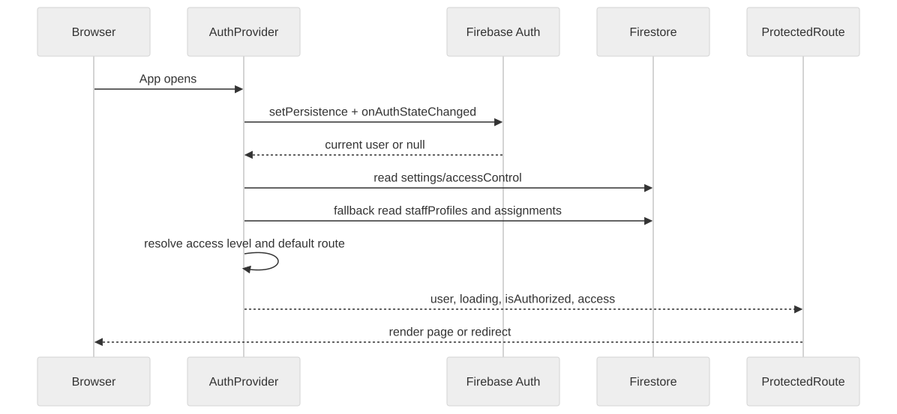
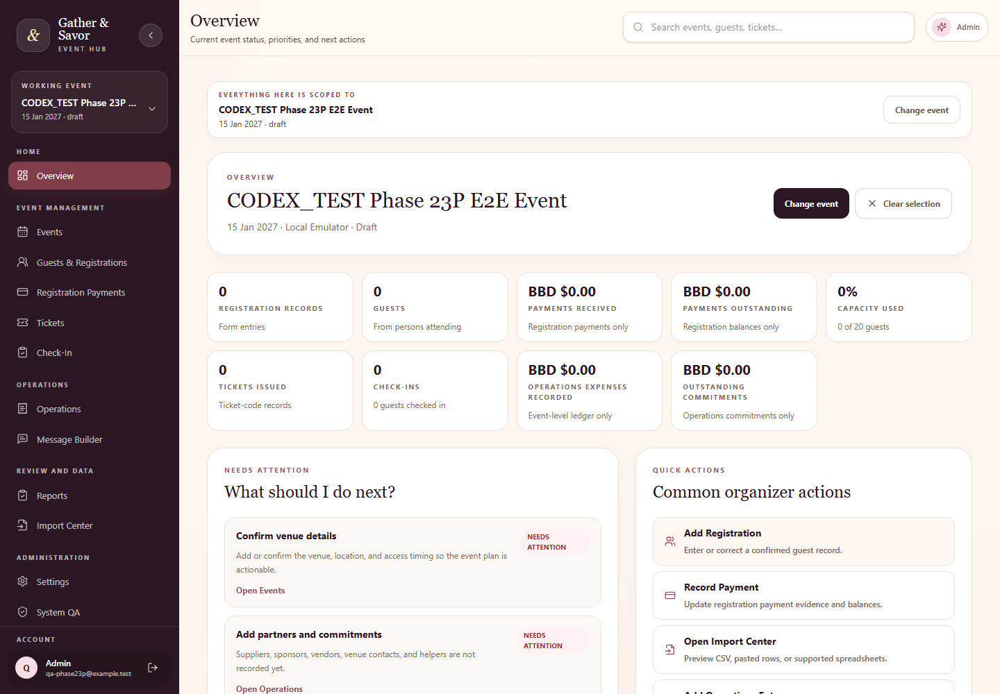
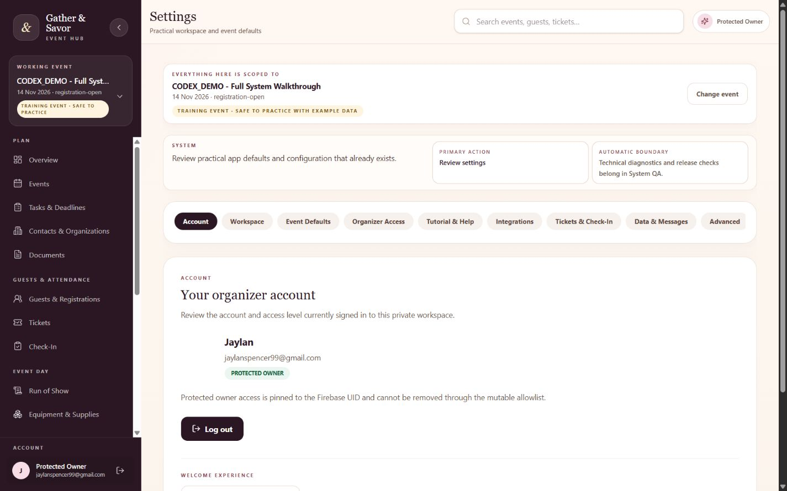
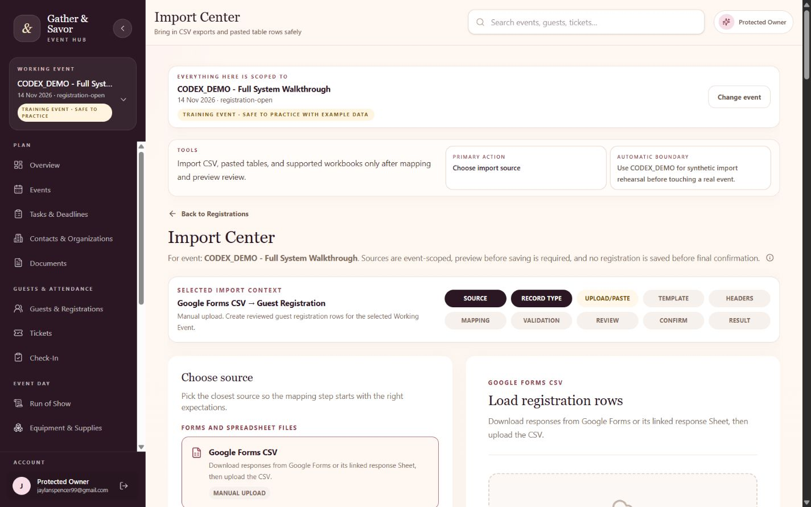

# Source File

manual/00-cover-and-document-control.md

# Gathetr Owner's Technical Operations, Development, Maintenance and Repair Manual

Displayed title: Gathetr Technical Manual

Document version: 2026-08-21 Phase 3B
Generated: 2026-08-21T05:44:25.749Z
Application source commit documented: 5234f87d467d1331909c75e2443f8efb641b7dde
Documentation source base commit: 2f8d4dfbf9420bcd2a444d1754886133e6aa604f
Documentation branch at generation: main
Repository: https://github.com/KuroJay246/gathervibes.git
Firebase project: gathervibeshub
Production URL: https://gathervibeshub.web.app
Status: Documentation-only manual repair and expansion

## Document Control

This manual covers the runtime application source at the recorded application commit and the documentation source snapshot rooted at the recorded documentation source base commit. It does not claim to describe later changes unless regenerated.

Source documents in `docs/` are authoritative. The HTML and PDF outputs are generated reading copies.

## How to Use This Manual

- Start with the Emergency Reference when the app is failing right now.
- Use the main manual chapters for architecture, routes, permissions, and feature maintenance.
- Use the Runbook Section for step-by-step diagnosis and repair.
- Use the appendices for field-level Firestore details, command safety, and route/file indexes.

## Revision History

- Phase 3: initial technical summary and first generated PDF.
- Phase 3B: rendering repair, runbook expansion, appendices, bookmarks, and PDF validation.

## Protected Boundaries

- Do not expose `.env.local`, cookies, tokens, service account JSON, or private Firebase keys.
- Do not use CPB for synthetic QA or fake data.
- QR payload format must remain `GSV:TICKET:{ticketCode}` unless explicitly approved and migrated.
- Firestore Rules, Auth, Hosting, Functions, and production data require explicit validation and approval before deployment.
- This Phase 3B documentation generation requires no Firebase deployment and makes no runtime behavior change.

# Source File

manual/01-quick-start-and-emergency-reference.md

# Quick Start and Emergency Reference

## Immediate Symptom Table

| Symptom | First check | Next manual section |
| --- | --- | --- |
| Blank page | Browser Console and Network; check stale chunk or Firebase config | Troubleshooting: blank page or dynamic import failure |
| Permission denied | Signed-in account, `settings/accessControl`, staff assignment, Firestore rule line | Permissions and Security; Permission runbooks |
| Login fails | Firebase Auth provider, authorized domain, popup/redirect state | Firebase Authentication; Login failure runbook |
| Scanner fails | Camera permission, HTTPS, QR payload, assigned event, ticket code lookup | Imports/Exports/QR; Scanner runbook |
| Build fails | Terminal error and changed files | Build Deployment and Recovery |
| Production fails | Hosting deployment, asset cache, Firebase project, Console | Emergency recovery runbooks |

## Safe First Commands

```powershell
git status --short --branch
git rev-list --left-right --count main...origin/main
npm run lint
npm test
npm run build
```

Do not run deployment commands while diagnosing unless the fix is known, tested, and approved.

# Source File

manual/02-application-overview.md

# Application Overview

Gathetr is a private React/Firebase event operations application for planning, guest management, registration payments, tickets, check-in, operations, run of show, resources, documents, contacts, reports, imports, message preparation, Settings, and System QA.

The active synthetic training event is `CODEX_DEMO - Full System Walkthrough`. CPB is real historical production data and must not receive synthetic writes.

## Main User Groups

- Protected Owner: UID-protected permanent owner access.
- Approved Organizer: active approved email in `settings/accessControl`.
- Staff roles: active `staffProfiles/{uid}` plus active event assignment.
- Scanner: assigned-event check-in-only route and narrow Firestore update path.

## Stack

| Layer | Actual technology |
| --- | --- |
| Frontend | React ^19.2.0, Vite ^7.2.4, React Router ^8.3.0 |
| Styling | Tailwind CSS ^4.1.17 through @tailwindcss/vite |
| Backend services | Firebase client SDK ^12.6.0 |
| Database | Cloud Firestore with local emulator tests |
| Authentication | Firebase Authentication with Google and email/password |
| Hosting | Firebase Hosting classic static SPA rewrites to index.html |
| QR | qrcode ^1.5.4; scanner uses html5-qrcode ^2.3.8 |
| Excel parsing | read-excel-file ^9.2.0; xlsx package intentionally absent |

# Source File

manual/03-system-architecture.md

# System Architecture

## High-Level Flow




Caption: high level architecture diagram.


## Important Boundaries

- Frontend route checks improve user experience but do not replace Firestore Rules.
- Firestore Rules are the backend security boundary.
- Audit logs are append-only evidence and are coupled to business mutations.
- Message Builder is copy-only; it does not send email.
- Documents are references/links and metadata only; no Firebase Storage upload is active.

# Source File

manual/04-project-file-map.md

# Project File Map

## Feature Ownership Map

| Feature | Main files | Related tests | Risk |
| --- | --- | --- | --- |
| Authentication and access resolution | src/lib/firebase.js; src/auth/AuthProvider.jsx; src/auth/ProtectedRoute.jsx; src/utils/accessRoles.js; src/config/protectedOwner.js | tests/auth-reliability.test.js; tests/protected-owner-authorization-matrix.test.js; tests/settings-access-management.test.js | High |
| Events and working event | src/pages/EventsPage.jsx; src/services/eventService.js; src/events/ActiveEventProvider.jsx; src/utils/eventPlanning.js | tests/event-utils.test.js; tests/phase26-event-categories-capabilities.test.js | High |
| Tasks and deadlines | src/pages/TasksPage.jsx; src/services/taskService.js; src/utils/taskWorkflow.js | tests/phase2-guided-event-setup-task-deadline.test.js; tests/task-workflow-rules.test.js | Medium |
| Guests and registrations | src/pages/RegistrationsPage.jsx; src/services/registrationService.js; src/utils/validators.js; src/utils/registrationMetrics.js | tests/registration-utils.test.js; tests/registration-metrics.test.js | High |
| Registration payments | src/pages/PaymentsPage.jsx; src/utils/financeUtils.js; src/utils/paymentStatus.js | tests/phase23b-payments-operations-boundaries.test.js; tests/payments-operations-refinement-2026-08.test.js | High |
| Review and reconciliation | src/pages/PaymentReconciliationPage.jsx; src/services/reconciliationReadService.js; src/utils/paymentReconciliation.js; src/utils/reconciliationWorkbook.js | tests/phase23c-payment-reconciliation.test.js | High |
| Tickets and QR | src/pages/TicketsPage.jsx; src/components/tickets/TicketQrCode.jsx; src/services/ticketService.js; src/utils/ticketUtils.js; src/utils/qrTicketUtils.js | tests/phase45-ticketing.test.js; tests/phase7-qr-checkin.test.js | High |
| Check-in and scanner | src/pages/CheckInPage.jsx; src/pages/ScannerPage.jsx; src/components/checkin/QrScannerPanel.jsx; src/utils/checkInUtils.js | tests/phase14-camera-checkin.test.js; tests/firestore-checkin-rules.test.js; e2e/workflows.spec.js | High |
| Imports and XLSX parsing | src/pages/ImportsPage.jsx; src/services/importService.js; src/utils/importUtils.js; src/utils/xlsxImport.js | tests/import-center.test.js; tests/import-center-workflow-upgrade.test.js | High |
| Operations ledger and commitments | src/pages/OperationsPage.jsx; src/services/operationsLedgerService.js; src/components/operations/PartnerCommitmentsPanel.jsx | tests/phase19-operations-productivity.test.js; tests/phase23b-payments-operations-boundaries.test.js | High |
| Run of Show | src/pages/RunOfShowPage.jsx; src/services/runOfShowService.js; src/utils/runOfShow.js | tests/run-of-show-resources-foundation.test.js; tests/run-of-show-resource-rules.test.js | Medium |
| Equipment and supplies | src/pages/ResourcesPage.jsx; src/services/eventResourceService.js; src/utils/eventResources.js | tests/run-of-show-resources-foundation.test.js; tests/run-of-show-resource-rules.test.js | Medium |
| Documents | src/pages/DocumentsPage.jsx; src/services/documentService.js; src/utils/documentRegistry.js | tests/document-contact-foundation.test.js; tests/document-contact-rules.test.js | Medium |
| Contacts and organizations | src/pages/ContactsPage.jsx; src/services/contactService.js; src/utils/contactDirectory.js | tests/document-contact-foundation.test.js; tests/document-contact-rules.test.js | Medium |
| Settings, staff, integrations | src/pages/SettingsPage.jsx; src/services/accessManagementService.js; src/services/staffManagementService.js; src/services/integrationSettingsService.js | tests/settings-access-management.test.js | High |
| Message Builder | src/pages/CommunicationsPage.jsx; src/utils/communicationsUtils.js | tests/phase6-communications.test.js | Medium |
| System QA | src/pages/QaPage.jsx; src/utils/qaHelper.js; src/utils/runtimeHealth.js | tests/production-qa.test.js; tests/settings-systemqa-tutorial-final-refinement.test.js | Medium |
| Tutorial/onboarding | src/tutorial/* | tests/onboarding-flow.test.js; tests/phase26-interactive-product-tour.test.js; e2e/tutorial.spec.js | Medium |

## Root Configuration

| Path | Purpose | Risk |
| --- | --- | --- |
| package.json | Scripts and dependencies for development, QA, E2E, Firebase deploy helpers, docs generation. | High |
| firebase.json | Auth provider notes, emulator ports, Firestore file references, Hosting headers and rewrites. | High |
| firestore.rules | Backend authorization and schema validation. | Critical |
| firestore.indexes.json | Firestore composite index configuration. | High |
| vite.config.js | Vite/React/Tailwind build configuration. | Medium |
| playwright.config.js | E2E browser test configuration and emulator env. | Medium |
| AI_AGENT_RULES.md | Permanent coding assistant governance. | High |

# Source File

manual/05-frontend-react-and-tailwind.md

# Frontend React and Tailwind

Entry point: `src/main.jsx`
Top-level app: `src/App.jsx`
Authenticated shell: `src/layout/AppShell.jsx`
Global styles: `src/styles.css`

## React Patterns

- Lazy-loaded route pages are declared in `src/App.jsx`.
- `ProtectedRoute` blocks unauthenticated or unauthorized users.
- `AppShell` owns desktop sidebar, mobile drawer, mobile tab bar, page titles, Admin Search, page guidance, and TutorialProvider wrapping.
- Firebase writes are kept in service modules under `src/services/`.
- Shared validation and display helpers live in `src/utils/`.

## Tailwind Usage

Tailwind is used directly through class names and the Vite Tailwind plugin. The app uses compact cards, dense grids, responsive `sm`, `md`, `lg`, `xl` breakpoints, and semantic color usage tied to the Gather & Savor visual system.

Troubleshooting:

- Element not visible: check responsive utility prefixes and route/access gating.
- Mobile overflow: inspect fixed widths, tables, and long event names.
- Dynamic class not applying: avoid constructing class strings that Tailwind cannot see statically.
- Form accessibility issue: inspect associated label, id, name, and focus behavior.

# Source File

manual/06-routing-and-navigation.md

# Routing and Navigation

Routes are declared in `src/App.jsx`; page titles and navigation groups are in `src/layout/AppShell.jsx`.

## Route Map

| Route | Title | Purpose | Component/Gate | Access | Source |
| --- | --- | --- | --- | --- | --- |
| /dashboard | Event Overview | Current event status, priorities, and next actions | <DashboardPage /> | Authenticated route gate | src/App.jsx; src/layout/AppShell.jsx |
| /events | Events | Plan and organize every gathering | <EventsPage /> | Authenticated route gate | src/App.jsx; src/layout/AppShell.jsx |
| /tasks | Tasks & Deadlines | Event-scoped work, blockers, and follow-up dates | <TasksPage /> | Authenticated route gate | src/App.jsx; src/layout/AppShell.jsx |
| /registrations | Guests & Registrations | Manage registration records and guest counts | <RegistrationsPage /> | Authenticated route gate | src/App.jsx; src/layout/AppShell.jsx |
| /payments | Registration Payments | Review registration charges, payments, balances, and follow-up | <AssignedEventGate purpose="Payments"><PaymentsPage /></AssignedEventGate> | Authenticated + assigned Working Event gate | src/App.jsx; src/layout/AppShell.jsx |
| /payments/reconciliation | Review & Reconcile Records | Read-only workbook comparison before any correction | <PaymentReconciliationPage /> | Authenticated route gate | src/App.jsx; src/layout/AppShell.jsx |
| /tickets | Tickets | Assign ticket codes and prepare QR access | <TicketsPage /> | Authenticated route gate | src/App.jsx; src/layout/AppShell.jsx |
| /check-in | Check-In | Track event-day attendance | <AssignedEventGate purpose="Check-In"><CheckInPage /></AssignedEventGate> | Authenticated + assigned Working Event gate | src/App.jsx; src/layout/AppShell.jsx |
| /operations | Operations | Track event-level money and obligations | <AssignedEventGate purpose="Operations"><OperationsPage /></AssignedEventGate> | Authenticated + assigned Working Event gate | src/App.jsx; src/layout/AppShell.jsx |
| /run-of-show | Run of Show | Event-day sequence, supplier arrivals, dependencies, and Now/Next | <AssignedEventGate purpose="Run of Show"><RunOfShowPage /></AssignedEventGate> | Authenticated + assigned Working Event gate | src/App.jsx; src/layout/AppShell.jsx |
| /resources | Equipment & Supplies | Equipment, supplies, packing, pickup, and return tracking | <AssignedEventGate purpose="Resources"><ResourcesPage /></AssignedEventGate> | Authenticated + assigned Working Event gate | src/App.jsx; src/layout/AppShell.jsx |
| /documents | Documents | Event document references, links, and evidence | <DocumentsPage /> | Authenticated route gate | src/App.jsx; src/layout/AppShell.jsx |
| /contacts | Contacts & Organizations | Reusable people, businesses, and event relationships | <ContactsPage /> | Authenticated route gate | src/App.jsx; src/layout/AppShell.jsx |
| /event-review | Reports | Read-only follow-up, payments, operations, and summary | <EventReviewPage /> | Authenticated route gate | src/App.jsx; src/layout/AppShell.jsx |
| /imports | Import Center | Bring in CSV exports and pasted table rows safely | <ImportsPage /> | Authenticated route gate | src/App.jsx; src/layout/AppShell.jsx |
| /qa | System QA | System health, data checks, and safe test guidance | <QaPage /> | Authenticated route gate | src/App.jsx; src/layout/AppShell.jsx |
| /communications | Message Builder | Create, personalize, and copy event messages | <CommunicationsPage /> | Authenticated route gate | src/App.jsx; src/layout/AppShell.jsx |
| /settings | Settings | Practical workspace and event defaults | <SettingsPage /> | Authenticated route gate | src/App.jsx; src/layout/AppShell.jsx |




Caption: route map diagram.


Public route: `/login`.

Redirect aliases: `/security -> /settings`, `/reconciliation -> /payments/reconciliation`, `/reports -> /event-review`.

# Source File

manual/07-firebase-authentication.md

# Firebase Authentication

Firebase initialization is in `src/lib/firebase.js`. Authentication lifecycle is in `src/auth/AuthProvider.jsx`.

## Auth Sequence




Caption: auth sequence diagram.


Definitions:

- Authentication state: Firebase's current determination of whether a user is signed in.
- Authorization state: Gathetr's determination that the signed-in user has owner, approved organizer, or assigned staff access.

## Flow

1. App initializes Firebase from Vite environment variables.
2. Auth persistence is set to browser local persistence.
3. Firebase reports the current user through `onAuthStateChanged`.
4. Gathetr reads `settings/accessControl` for approved organizer access.
5. If organizer access is not found, it reads `staffProfiles/{uid}` and active assignment docs for supported event IDs.
6. `getUserAccessLevel` builds the access object used by route gates and labels.
7. Firestore Rules still enforce every backend read/write.

# Source File

manual/08-firestore-data-model.md

# Firestore Data Model

This dictionary is based on current services, Firestore Rules, and tests. It does not include real production personal data.

## Collections and Subcollections

| Collection path | Purpose | Code that uses it | Rules reference | Security note |
| --- | --- | --- | --- | --- |
| settings/accessControl | Authoritative approved organizer source plus metadata records. | src/auth/AuthProvider.jsx; src/services/accessManagementService.js; src/pages/SettingsPage.jsx | firestore.rules match /settings/accessControl | Protected Owner only for mutations; approved admins read. |
| settings/accessControl/history/{historyId} | Append-only history for organizer access changes. | src/services/accessManagementService.js | firestore.rules match /settings/accessControl/history/{historyId} | Protected Owner create; approved admins read. |
| settings/integrations | Supported integration status settings surfaced in Settings. | src/services/integrationSettingsService.js | firestore.rules match /settings/integrations | Protected Owner create/update; approved admins read. |
| events/{eventId} | Event records, planning data, capability configuration, and working-event source. | src/services/eventService.js; src/events/ActiveEventProvider.jsx | firestore.rules match /events/{eventId} | Approved admins manage; assigned staff can read assigned events. |
| events/{eventId}/staffAssignments/{uid} | Event-scoped staff assignment records. | src/services/staffManagementService.js; src/auth/AuthProvider.jsx | firestore.rules match /events/{eventId}/staffAssignments/{uid} | Approved admins manage; assigned user can read own active assignment. |
| events/{eventId}/tasks/{taskId} | Event-scoped tasks and deadlines. | src/services/taskService.js | firestore.rules match /events/{eventId}/tasks/{taskId} | Approved admins and assigned event managers manage; viewers can read. |
| registrations/{registrationId} | Guest registration, ticket, payment, and check-in status records. | src/services/registrationService.js; src/services/ticketService.js | firestore.rules match /registrations/{registrationId} | Approved admins manage; assigned scanners can perform narrow check-in updates. |
| auditLogs/{logId} | Append-only audit evidence for business mutations. | src/services/auditService.js; service write batches | firestore.rules match /auditLogs/{logId} | Create only when matching a permitted target mutation; never update/delete. |
| operationsLedger/{ledgerEntryId} | Event-level Operations ledger, commitments, partners, in-kind support. | src/services/operationsLedgerService.js | firestore.rules match /operationsLedger/{ledgerEntryId} | Approved admins create/update; no delete. |
| events/{eventId}/documents/{documentId} | Event document references and external links. No Firebase Storage upload. | src/services/documentService.js | firestore.rules match /events/{eventId}/documents/{documentId} | Approved admins and event managers create/update; admins delete. |
| events/{eventId}/runOfShow/{itemId} | Event-day schedule sequence, dependencies, arrivals, status. | src/services/runOfShowService.js | firestore.rules match /events/{eventId}/runOfShow/{itemId} | Approved admins manage; assigned event staff can read through task read gate. |
| events/{eventId}/resources/{resourceId} | Equipment, supplies, packing, pickup, return, quantity tracking. | src/services/eventResourceService.js | firestore.rules match /events/{eventId}/resources/{resourceId} | Approved admins manage; assigned event staff can read through task read gate. |
| contacts/{contactId} | Reusable contact directory. | src/services/contactService.js | firestore.rules match /contacts/{contactId} | Approved admins create/update/read; delete false. |
| organizations/{organizationId} | Reusable organization directory. | src/services/contactService.js | firestore.rules match /organizations/{organizationId} | Approved admins create/update/read; delete false. |
| events/{eventId}/contactLinks/{linkId} | Event relationship links to contacts/organizations. | src/services/contactService.js | firestore.rules match /events/{eventId}/contactLinks/{linkId} | Approved admins and event managers create/update; admins delete. |
| accessRequests/{requestId} | Signed-in user access request workflow. | src/services/accessRequestContract.js | firestore.rules match /accessRequests/{requestId} | Signed-in create; approved admins review; no delete. |
| staffProfiles/{uid} | Global staff profile records. | src/services/staffManagementService.js; src/auth/AuthProvider.jsx | firestore.rules match /staffProfiles/{uid} | Approved admins manage; staff can read own active profile. |

## Indexes

| Collection group | Fields | Purpose |
| --- | --- | --- |
| registrations | eventId ASCENDING, createdAt DESCENDING | Supports scoped Firestore query ordering used by the app. |

## Schema Truth Rule

Do not infer schema from one example record. Cross-check service writes, page reads, utils, Firestore Rules validators, and tests.

# Source File

manual/09-permissions-and-security-rules.md

# Permissions and Security Rules

Permission architecture has two layers:

1. Frontend access checks in `src/utils/accessRoles.js` and `ProtectedRoute`.
2. Firestore Rules in `firestore.rules`.




Caption: permission flow diagram.


## Permission Matrix

| Action | Protected Owner | Approved Organizer/Admin | Assigned Staff | Scanner | Unapproved |
| --- | --- | --- | --- | --- | --- |
| Open organizer shell | Yes | Yes | Limited by assigned route | No, scanner uses /scanner | No |
| Manage Settings organizer access | Yes, immutable owner cannot be removed | No owner-only controls | No | No | No |
| Create/update events | Yes | Yes | No | No | No |
| Read assigned event | Yes | Yes | Yes if assignment active | Yes for scanner route | No |
| Create/update registrations | Yes | Yes | No | No except scanner check-in fields | No |
| Assign tickets | Yes | Yes | No | No | No |
| Complete check-in | Yes | Yes | No unless scanner assignment | Yes for assigned event | No |
| Use Operations ledger | Yes | Yes | operations-helper read only | No | No |
| Use Import Center | Yes | Yes | No | No | No |
| Read documents/tasks as assigned staff | Yes | Yes | event-manager/viewer where allowed | No | No |
| Create audit logs | Only with matching mutation | Only with matching mutation | Only where rules allow matching mutation | Only check-in audit path | No |

## Firestore Rules Reference

Important helper functions include `isSignedIn`, `isProtectedOwner`, `isApprovedAdmin`, `activeStaffProfile`, `activeStaffAssignment`, `isAssignedScanner`, `canReadTask`, and `canManageTask`.

Rules distinguish `resource.data` from `request.resource.data`, and create/read/update/delete paths are intentionally different. Query rules are not filters: if a query can return forbidden documents, Firestore denies the whole query.

# Source File

manual/10-events-guests-tickets-and-checkin.md

# Events, Guests, Tickets, and Check-In

## Event Management

Events are managed by `EventsPage` and `eventService`. The Working Event context determines which event-scoped pages load data.

## Guest Registrations

Registrations include guest identity, persons attending, payment state, ticket status, historical attendance evidence, and scanner-confirmed check-in fields. Registration mutations must stay atomic with audit evidence.

## Tickets and QR

QR payload is exactly:

```text
GSV:TICKET:{ticketCode}
```

Do not put private guest data into QR payloads.

## Check-In Flow




Caption: qr checkin flow diagram.

# Source File

manual/11-imports-exports-and-qr-systems.md

# Imports, Exports, and QR Systems

## Import Flow




Caption: import flow diagram.


Supported sources: CSV, XLSX through `read-excel-file`, and pasted table rows. The app uses preview-first validation, explicit sheet confirmation, duplicate detection, ticket-code collision checks, and chunked writes with audits.

Exports are client-side generated files from `src/utils/exportUtils.js` and related finance/reconciliation helpers. Audit log and access-control collections are not included in ordinary organizer exports.

# Source File

manual/12-testing-and-quality-assurance.md

# Testing and Quality Assurance

## Command Reference

| Command | Purpose | Actual script | When to run | Expected result |
| --- | --- | --- | --- | --- |
| npm run dev | Local validation/development command | vite | During development, QA, or documentation validation | Exit code 0; command-specific pass message |
| npm run build | Local validation/development command | vite build | During development, QA, or documentation validation | Exit code 0; command-specific pass message |
| npm run preview | Local validation/development command | vite preview | During development, QA, or documentation validation | Exit code 0; command-specific pass message |
| npm run docs:generate | Local validation/development command | node scripts/docs/generateTechnicalManual.mjs | During development, QA, or documentation validation | Exit code 0; command-specific pass message |
| npm run docs:validate | Local validation/development command | node scripts/docs/validateTechnicalDocs.mjs | During development, QA, or documentation validation | Exit code 0; command-specific pass message |
| npm run lint | Local validation/development command | eslint src tests scripts e2e eslint.config.js vite.config.js playwright.config.js | During development, QA, or documentation validation | Exit code 0; command-specific pass message |
| npm run test | Local validation/development command | node --test tests/*.test.js | During development, QA, or documentation validation | Exit code 0; command-specific pass message |
| npm run doctor | Local validation/development command | react-doctor . --project . --scope full --blocking none --no-telemetry | During development, QA, or documentation validation | Exit code 0; command-specific pass message |
| npm run doctor:changed | Local validation/development command | react-doctor . --project . --scope changed --base main --blocking error --no-telemetry | During development, QA, or documentation validation | Exit code 0; command-specific pass message |
| npm run doctor:json | Local validation/development command | react-doctor . --project . --scope full --blocking none --json --json-compact --no-telemetry | During development, QA, or documentation validation | Exit code 0; command-specific pass message |
| npm run product:copy-scan | Local validation/development command | node scripts/product/copyScan.mjs | During development, QA, or documentation validation | Exit code 0; command-specific pass message |
| npm run product:routes | Local validation/development command | node scripts/product/routeInventory.mjs | During development, QA, or documentation validation | Exit code 0; command-specific pass message |
| npm run product:bundle | Local validation/development command | node scripts/product/bundleSummary.mjs | During development, QA, or documentation validation | Exit code 0; command-specific pass message |
| npm run product:docs | Local validation/development command | node scripts/product/documentationCheck.mjs | During development, QA, or documentation validation | Exit code 0; command-specific pass message |
| npm run product:legacy | Local validation/development command | node scripts/product/legacyControlCheck.mjs | During development, QA, or documentation validation | Exit code 0; command-specific pass message |
| npm run product:qa | Local validation/development command | node scripts/product/runProductCommand.mjs qa | During development, QA, or documentation validation | Exit code 0; command-specific pass message |
| npm run product:audit | Local validation/development command | node scripts/product/runProductCommand.mjs audit | During development, QA, or documentation validation | Exit code 0; command-specific pass message |
| npm run product:qa:emulator-checks | Local validation/development command | node --test tests/firestore-checkin-rules.test.js tests/task-workflow-rules.test.js tests/document-contact-rules.test.js tests/run-of-show-resource-rules.test.js && npm run e2e:smoke:inner | During development, QA, or documentation validation | Exit code 0; command-specific pass message |
| npm run e2e:smoke | Local validation/development command | npx -y firebase-tools@14.19.0 emulators:exec --only auth,firestore --project gathervibeshub "npm run e2e:smoke:inner" | During development, QA, or documentation validation | Exit code 0; command-specific pass message |
| npm run e2e:smoke:inner | Local validation/development command | playwright test --project=chromium e2e/navigation.spec.js | During development, QA, or documentation validation | Exit code 0; command-specific pass message |
| npm run e2e:full | Local validation/development command | npx -y firebase-tools@14.19.0 emulators:exec --only auth,firestore --project gathervibeshub "playwright test --project=chromium" | During development, QA, or documentation validation | Exit code 0; command-specific pass message |
| npm run e2e:firefox | Local validation/development command | npx -y firebase-tools@14.19.0 emulators:exec --only auth,firestore --project gathervibeshub "playwright test --project=firefox" | During development, QA, or documentation validation | Exit code 0; command-specific pass message |
| npm run e2e:webkit | Local validation/development command | npx -y firebase-tools@14.19.0 emulators:exec --only auth,firestore --project gathervibeshub "playwright test --project=webkit" | During development, QA, or documentation validation | Exit code 0; command-specific pass message |
| npm run admin:ensure-access | Local validation/development command | node scripts/admin/ensureAccessControl.mjs | During development, QA, or documentation validation | Exit code 0; command-specific pass message |
| npm run admin:verify-firebase | Local validation/development command | node scripts/admin/verifyFirebaseSetup.mjs | During development, QA, or documentation validation | Exit code 0; command-specific pass message |
| npm run admin:replace-codex-test-with-demo | Local validation/development command | node scripts/admin/replaceCodexTestWithDemoEvent.mjs | During development, QA, or documentation validation | Exit code 0; command-specific pass message |
| npm run admin:verify-production-fixtures | Local validation/development command | node scripts/admin/verifyProductionFixtures.mjs | During development, QA, or documentation validation | Exit code 0; command-specific pass message |
| npm run admin:verify-production-counts | Local validation/development command | node scripts/admin/verifyProductionCounts.mjs | During development, QA, or documentation validation | Exit code 0; command-specific pass message |
| npm run firebase:deploy-rules | PRODUCTION-IMPACTING COMMAND where noted | npx firebase-tools deploy --only firestore:rules,firestore:indexes --project gathervibeshub | Only after explicit approval and validation | Exit code 0; command-specific pass message |
| npm run firebase:deploy-hosting | PRODUCTION-IMPACTING COMMAND where noted | npx firebase-tools deploy --only hosting --project gathervibeshub | Only after explicit approval and validation | Exit code 0; command-specific pass message |
| npm run firebase:deploy-all | PRODUCTION-IMPACTING COMMAND where noted | npx firebase-tools deploy --only firestore:rules,firestore:indexes,hosting --project gathervibeshub | Only after explicit approval and validation | Exit code 0; command-specific pass message |

## Testing Layers

- Unit and source contract tests: `tests/*.test.js`.
- Firestore Rules tests: rules-specific test files run against emulators.
- E2E smoke: `e2e/navigation.spec.js`.
- Accessibility and responsive E2E: `e2e/accessibility.spec.js`, `e2e/responsive.spec.js`.
- Product QA wrapper: `npm run product:qa`.
- React Doctor: `npm run doctor:json` or `npm run doctor:changed`.

## Date-Sensitive Test Policy

Phase 2 found `tests/document-contact-foundation.test.js` used `2026-08-20` as an expiring-soon fixture. On 2026-08-21 that fixture became expired for helpers using the current clock. It was updated to `2026-08-30` to preserve the intended behavior.

Future date-sensitive tests should either inject an explicit clock into every helper under test or choose dates far enough away to avoid silent expiry.

# Source File

manual/13-build-deployment-and-recovery.md

# Build, Deployment, and Recovery

## Local Build

```powershell
npm ci
npm run lint
npm test
npm run build
npm run product:qa
```

## Firebase Project

Default project in `.firebaserc`: `gathervibeshub`.

Hosting public folder: `dist`.

Security headers and SPA rewrite are configured in `firebase.json`.

## Production-Impacting Commands

| Command | Impact | Prerequisites |
| --- | --- | --- |
| npm run firebase:deploy-hosting | PRODUCTION-IMPACTING COMMAND: deploys Hosting assets from dist. | Build passed; production visual check plan ready. |
| npm run firebase:deploy-rules | PRODUCTION-IMPACTING COMMAND: deploys Firestore Rules and indexes. | Rules tests passed; authorization impact reviewed. |
| npm run firebase:deploy-all | PRODUCTION-IMPACTING COMMAND: deploys Hosting, Rules, and indexes. | Use only when all targets intentionally changed. |

## Deployment Flow




Caption: deployment flow diagram.


No production deployment is performed by documentation generation.

# Source File

manual/14-troubleshooting-and-repairs.md

# Troubleshooting and Repairs

Use the runbooks in `docs/runbooks/` for step-by-step procedures.

Priority problems:

- Blank page or stale deployment chunk.
- Login or auth persistence failure.
- Missing or insufficient permissions.
- Owner account denied.
- Staff assignment missing.
- Scanner cannot check in.
- Firestore permits data that frontend hides or frontend shows data Firestore denies.
- Build, dependency, emulator, or deployment failure.
- QR scanner failure during an event.

# Source File

manual/15-legacy-systems-and-technical-debt.md

# Legacy Systems and Technical Debt

## Current Register

| Item | Classification | Notes |
| --- | --- | --- |
| Archived migration evidence | archive only / future review required | Located at C:\Users\Jaylan\Documents\Archived Projects\gsv-codex-demo-migration-evidence-2026-08-21. Contains CPB/CODEX_DEMO evidence and old repo snapshots. |
| Legacy repository archive | archive only | Located at C:\Users\Jaylan\Documents\Archived Projects\gathervibes-legacy-repository-archive-2026-08-21. |
| 21 node_modules in historical archive snapshots | future review required | Generated dependencies likely reclaimable, but recursive deletion was blocked in Phase 2. |
| Historical branches | future review required | Branches were not deleted in Phase 2. Review merge status before any cleanup. |
| Active copilot worktree | current / unknown future work | Retained at C:\Users\Jaylan\Documents\gathetr.worktrees\copilot-personalized-welcome-tour-implementation. |
| React Doctor warnings | technical debt | doctor:json reports warnings, but doctor:changed found no issues for Phase 2 changed file. |
| Legacy role aliases | legacy but required | accessRoles retains aliases such as checkInStaff for compatibility. |

# Source File

manual/16-change-management.md

# Change Management

No meaningful coding task is complete until documentation impact has been reviewed.

Every handoff must report:

- Documentation reviewed: YES/NO
- Documentation changed: YES/NO
- Documentation files changed
- Reason no documentation update was required

Use templates in `docs/templates/` for change records, incidents, repair runbooks, release checklists, and manual update checklists.

# Source File

manual/17-reference-and-glossary.md

# Reference and Glossary

## Glossary

- Approved Organizer: an active email in `settings/accessControl`.
- Protected Owner: the permanent UID-protected owner account, independent of mutable allowlists.
- Working Event: selected event context used by event-scoped pages.
- CODEX_DEMO: synthetic training event safe for reversible QA.
- CPB: real completed event; not a synthetic QA target.
- Audit log: append-only evidence document required for many business writes.
- Query rules are not filters: Firestore denies a query if it could return unauthorized documents.

## Search Keywords

```text
Firebase missing or insufficient permissions resource.data request.resource.data
Firestore query rules are not filters
React Firebase auth state loading before Firestore query
Vite dynamic import Failed to fetch dynamically imported module
Firebase Hosting stale service worker chunk cache
Playwright Firebase emulator auth firestore port taken 9099 8080
html5-qrcode camera permission HTTPS mobile browser
GSV:TICKET QR payload ticketCode privacy
read-excel-file browser XLSX import mapping
React Doctor no-loading-flag-reset-outside-finally
```

# Source File

manual/18-future-app-development-reference.md

# Future App Development Reference

Lessons from Gathetr that apply to future React/Firebase apps:

- Design the permission model before building pages.
- Keep frontend route gates and backend Rules aligned but separate.
- Use one authoritative source for access control and display it in Settings.
- Avoid synthetic QA against real event data.
- Keep QR payloads privacy-safe and stable.
- Add emulator-backed rule tests before deploying Rules.
- Document every schema, role, status, and workflow change at the time it changes.
- Keep generated PDFs as snapshots, not the source of truth.

# Source File

runbooks/01-application-and-session-failures.md

# Runbook 1. Application and Session Failures

## Purpose

Repair organizer-facing failures where the app does not boot correctly, loses session state, or loops back to login.

## Symptoms

- Blank page after navigation.
- `Failed to fetch dynamically imported module`.
- Login succeeds briefly, then the app returns to `/login`.
- Session does not persist across refresh.
- Firebase appears unavailable in the browser.

## Severity

High.

## Possible causes

- Stale browser cache after a Hosting release.
- Broken dynamically imported bundle.
- Firebase config mismatch.
- Persistence setup failure in `AuthProvider`.
- Browser storage or cookie restrictions.

## Safety warnings

- Do not deploy while diagnosing unless the fix is already proven.
- Do not clear production data or mutate auth state to test a theory.

## Evidence to collect

- Current route and query string.
- Console error text.
- Network failures for JS chunks or Firebase requests.
- Signed-in user state if visible.
- App build commit shown by diagnostics where available.

## First checks

1. Confirm whether the issue reproduces after hard refresh.
2. Check console for dynamic-import, Firebase, or storage errors.
3. Check whether the browser is offline or unstable.
4. Confirm the route is expected for the current role and Working Event.

## Files to inspect

- `src/components/AppErrorBoundary.jsx`
- `src/utils/appErrorDiagnostics.js`
- `src/lib/firebase.js`
- `src/auth/AuthProvider.jsx`
- `src/auth/ProtectedRoute.jsx`
- `firebase.json`

## Commands to run

- `npm run build`
- `npm run product:qa`
- `npm run e2e:smoke`
- `npm run admin:verify-firebase` only if a safe production-read check is justified

## Step-by-step diagnosis

1. If the screen is blank and console shows a failed chunk fetch, treat it as stale deployment drift first.
2. Reload with a cache-busting navigation and confirm the requested JS asset exists in the current build output.
3. If the app returns to `/login`, inspect `AuthProvider` persistence setup and the computed return route.
4. If Firebase initialization fails, verify `VITE_FIREBASE_*` values are present in the active environment without exposing secrets.
5. If the browser loses auth only on refresh, inspect local persistence restrictions or browser storage failures.

## Repair options

- Stale chunk: redeploy only the correct hosting build in a later release phase, then hard-refresh.
- Session failure: correct persistence or return-path logic and retest locally.
- Firebase boot issue: correct local environment or document missing configuration.

## Verification

- Organizer can load `/dashboard` after refresh without losing session.
- No dynamic-import failure remains in console.
- `npm run product:qa` and `npm run e2e:smoke` pass.

## Rollback

- Revert the bad frontend commit or restore the previous Hosting release.

## Escalation conditions

- Protected Owner cannot sign in.
- Dynamic-import failure persists across clean local rebuild and validated release artifact.
- Firebase configuration appears broken in production.

## Search keywords

- blank page
- dynamic import
- stale deployment chunk
- auth persistence
- session lost
- return to login

## Related tests

- `tests/error-boundary-classification*.test.js`
- `tests/auth-reliability.test.js`
- `e2e/navigation.spec.js`

## Related manual sections

- Application Overview
- Firebase Authentication
- Build, Deployment, and Recovery

# Source File

runbooks/02-permission-and-access-failures.md

# Runbook 2. Permission and Access Failures

## Purpose

Repair access failures involving Protected Owner, approved organizers, staff profiles, staff assignments, and rule/frontend mismatches.

## Symptoms

- Protected Owner denied in Settings or core organizer routes.
- Approved organizer denied despite visible record in Settings.
- Staff profile not recognized.
- Staff event assignment missing or ignored.
- Frontend allows a route but Firestore denies access.
- Firestore allows access that the frontend hides.
- Query denied because Firestore Rules are not filters.

## Severity

High.

## Possible causes

- `settings/accessControl` record mismatch.
- Organizer status not active.
- UID-based Protected Owner bypass missing from app state or misunderstood in diagnosis.
- Inactive `staffProfiles/{uid}`.
- Missing or inactive `events/{eventId}/staffAssignments/{uid}`.
- Query shape too broad for rule visibility.
- Route gate logic drift from Rules.

## Safety warnings

- Never weaken Rules to make a query succeed.
- Never remove or mutate the Protected Owner account as a debugging shortcut.

## Evidence to collect

- Signed-in email and UID.
- Access level resolved in the app.
- Target route and target collection/query.
- Exact Firestore permission error text.
- Relevant Settings screen status.

## First checks

1. Confirm whether the user is Protected Owner, approved organizer, or staff.
2. Confirm organizer status is active in `settings/accessControl`.
3. Confirm staff profile status is active.
4. Confirm event assignment exists and matches the target event.

## Files to inspect

- `src/auth/AuthProvider.jsx`
- `src/utils/accessRoles.js`
- `src/auth/ProtectedRoute.jsx`
- `src/services/accessManagementService.js`
- `src/services/staffManagementService.js`
- `firestore.rules`

## Commands to run

- `npm test`
- `npm run product:qa`
- `npm run admin:verify-production-fixtures` only for safe production reads

## Step-by-step diagnosis

1. For Protected Owner denial, confirm the signed-in UID matches the immutable owner UID and that the app state still marks owner capability true.
2. For approved organizer denial, inspect `approvedEmails`, `rolesByEmail`, and `approvedOrganizerRecords` together; only active records should authorize.
3. For staff denial, confirm both the global profile and event assignment are active and use the same UID/event id pair.
4. If the frontend shows the route but Firestore denies, compare the query or write shape against the relevant rule block and reduce scope rather than broadening Rules.
5. If Firestore would allow but the UI hides, compare `canViewRoute` capability mapping with the Rules-backed intent and update the app contract, not live data.

## Repair options

- Correct stale organizer/staff metadata in approved owner-only settings tooling.
- Correct query scope so Firestore Rules can evaluate it safely.
- Update route/capability logic to match existing Rules when the backend contract is already correct.
- Document unsupported legacy records as `UNKNOWN — REQUIRES FUTURE VERIFICATION` if proof is missing.

## Verification

- Target user reaches only the routes their role should support.
- Matching Firestore reads/writes succeed or fail exactly as intended.
- Settings still prevents disabling or removing Protected Owner.

## Rollback

- Revert the route/access logic change or restore prior approved organizer metadata.

## Escalation conditions

- Protected Owner cannot recover access.
- A fix would require broadening Rules without narrow proof.
- The same query must read mixed-visibility documents.

## Search keywords

- missing or insufficient permissions
- protected owner denied
- approved organizer denied
- staff assignment missing
- rules are not filters

## Related tests

- `tests/protected-owner-authorization-matrix.test.js`
- `tests/settings-access-management.test.js`
- Rules tests covering registrations, tasks, documents, contacts, run-of-show, and resources

## Related manual sections

- Firebase Authentication
- Permissions and Security Rules
- Settings and staff access guidance

# Source File

runbooks/03-scanner-ticket-and-checkin-failures.md

# Runbook 3. Scanner, Ticket, and Check-In Failures

## Purpose

Repair event-day failures involving scanner access, camera use, QR parsing, ticket lookup, and duplicate attendance handling.

## Symptoms

- Scanner route opens but no assigned event loads.
- Browser camera cannot open.
- QR code scans but is not recognized.
- Ticket lookup fails.
- Duplicate check-in warning appears.

## Severity

High during live operations.

## Possible causes

- Missing active scanner assignment.
- Browser camera permission denied or insecure origin.
- QR payload not using `GSV:TICKET:{ticketCode}`.
- Ticket code missing, invalid, or duplicated.
- Registration already checked in.

## Safety warnings

- Do not change QR format during live diagnosis.
- Do not use CPB or real production attendees for synthetic scanner rehearsal.

## Evidence to collect

- Event id and scanner user.
- Camera permission state.
- Scanned payload text if safely visible.
- Registration `ticketCode`, `ticketStatus`, `checkedIn`, and `checkInTime`.

## First checks

1. Confirm the scanner user has an active assignment for the target event.
2. Confirm the page is running on HTTPS or a trusted localhost context.
3. Confirm the scanned value starts with `GSV:TICKET:`.
4. Confirm the registration exists in the selected or assigned event.

## Files to inspect

- `src/pages/ScannerPage.jsx`
- `src/pages/CheckInPage.jsx`
- `src/components/checkin/QrScannerPanel.jsx`
- `src/utils/qrTicketUtils.js`
- `src/utils/checkInUtils.js`
- `src/services/ticketService.js`

## Commands to run

- `npm test -- tests/phase14-camera-checkin.test.js`
- `npm test -- tests/phase7-qr-checkin.test.js`
- `npm run e2e:smoke`

## Step-by-step diagnosis

1. For missing assigned event, inspect resolved assignments in app state and confirm event id equality.
2. For camera failure, inspect browser permission state and HTTPS context before touching app code.
3. For unrecognized QR, parse the value with `qrTicketUtils` and compare it to the registration list for the active event only.
4. For lookup failure, confirm the registration has a current `ticketCode` and that duplicate ticket codes were not imported.
5. For duplicate attendance, inspect `checkedIn`, `checkInTime`, and audit history before offering undo.

## Repair options

- Correct assignment/profile state.
- Correct QR payload generation or lookup code while preserving the prefix standard.
- Regenerate or remove a bad ticket assignment through the ticket workflow.
- Use the narrow undo check-in path when attendance was recorded in error.

## Verification

- Scanner opens the assigned event correctly.
- Camera path can scan a valid QR.
- Check-in writes only the approved narrow attendance fields plus audit log.

## Rollback

- Restore the previous ticket code state or revert the event-day UI change.

## Escalation conditions

- QR payload format appears to have drifted.
- Duplicate ticket codes exist across active event registrations.
- Check-in writes require broader Rules changes.

## Search keywords

- scanner cannot open assigned event
- camera permission denied
- QR not recognized
- ticket lookup fails
- duplicate check-in

## Related tests

- `tests/phase14-camera-checkin.test.js`
- `tests/phase7-qr-checkin.test.js`
- `tests/firestore-checkin-rules.test.js`

## Related manual sections

- Events, Guests, Tickets, and Check-In
- Imports, Exports, and QR Systems

# Source File

runbooks/04-import-and-data-repair.md

# Runbook 4. Import and Data Repair

## Purpose

Repair import failures, invalid mapping, duplicate registration detection, ticket collisions, and legacy record shape issues.

## Symptoms

- Registration import fails before confirm or during chunked write.
- Spreadsheet mapping is invalid.
- Duplicate registration import warnings block progress.
- Ticket-code collision occurs.
- Old Firestore record is missing ownership or permission fields.

## Severity

Medium to High depending on whether live registration intake is blocked.

## Possible causes

- Unsupported sheet/header shape.
- Missing event price or finance data.
- Duplicate `sourceRowId`, ticket code, or strong contact match.
- Legacy records missing modern optional fields.
- Import preview data not normalized before write.

## Safety warnings

- Never bypass preview and validation to force-import data.
- Never bulk-write to production while the duplicate or ticket-collision root cause is unknown.

## Evidence to collect

- Source type and selected sheet.
- Header mapping status.
- Preview row classifications.
- Exact blocking row ids and ticket codes.
- Existing registration ids involved in collisions.

## First checks

1. Confirm the selected source type matches the file or pasted data.
2. Confirm the sheet selection step completed for XLSX sources.
3. Confirm duplicate warnings are event-scoped, not cross-event assumptions.
4. Confirm ticket codes are unique within the active event.

## Files to inspect

- `src/pages/ImportsPage.jsx`
- `src/services/importService.js`
- `src/utils/importUtils.js`
- `src/utils/xlsxImport.js`
- `src/utils/validators.js`
- `src/utils/qrTicketUtils.js`

## Commands to run

- `npm test -- tests/import-center.test.js`
- `npm test -- tests/import-center-workflow-upgrade.test.js`
- `npm test -- tests/xlsx*.test.js`

## Step-by-step diagnosis

1. Reproduce with a local copy of the source file and confirm where the workflow stops: source, mapping, validation, review, confirm, or result.
2. Compare incoming headers to the source-type expectations already defined in the app.
3. Inspect duplicate classification: soft warning, needs review, or hard block.
4. For ticket collisions, compare imported ticket codes to existing event registrations and earlier rows in the same batch.
5. For old records, normalize on edit rather than mutating historical production data in bulk without approval.

## Repair options

- Add or correct header mapping support.
- Improve preview normalization or safe defaults.
- Fix duplicate logic if it over-classifies across unrelated event rows.
- Remove or regenerate conflicting ticket codes in the proper ticket flow.

## Verification

- Import preview reaches final confirm without hidden writes.
- Confirmed import writes only valid event-scoped registration rows.
- Duplicate and ticket-collision protections remain active.

## Rollback

- Revert the import parser or mapping change and preserve the failing sample for future repair.

## Escalation conditions

- A fix would require rewriting historical production records without review.
- The imported source contains private or inconsistent data that cannot be normalized safely.

## Search keywords

- import failure
- spreadsheet mapping invalid
- duplicate registration
- ticket collision
- legacy record missing fields

## Related tests

- Import Center test suite
- finance and QR privacy tests

## Related manual sections

- Imports, Exports, and QR Systems
- Field-Level Firestore Dictionary

# Source File

runbooks/05-development-build-and-test-failures.md

# Runbook 5. Development, Build, and Test Failures

## Purpose

Repair local dependency, build, emulator, unit-test, Firestore Rules test, Playwright, and React Doctor failures.

## Symptoms

- Dependency install fails.
- Build fails.
- Emulator port collision.
- Unit tests fail.
- Firestore Rules tests fail.
- Playwright/E2E fails.
- React Doctor warning requires review.

## Severity

Medium for local-only work, High when blocking release validation.

## Possible causes

- Node dependency mismatch.
- Vite import failure or unresolved module.
- Java or emulator process conflict.
- Stale fixture assumptions.
- Rule/test contract drift.
- Local browser runner instability.

## Safety warnings

- Do not treat an emulator-only failure as proof of production failure without corroboration.
- Do not ignore React Doctor blocking findings on changed code.

## Evidence to collect

- Exact failing command.
- Exit code and first actionable stack line.
- Occupied ports.
- Last passing commit if known.

## First checks

1. Confirm clean install state with current lockfile.
2. Confirm ports 8080 and 9099 are free before emulator runs.
3. Confirm the failing test is not using an expired date-sensitive fixture.

## Files to inspect

- `package.json`
- `package-lock.json`
- `vite.config.js`
- `playwright.config.js`
- `firestore.rules`
- The failing test file and nearest helper

## Commands to run

- `npm run lint`
- `npm test`
- `npm run build`
- `npm run product:qa`
- `npm run doctor:changed`

## Step-by-step diagnosis

1. Re-run the narrow failing command first.
2. If the failure is emulator startup, stop the stale process rather than changing tests immediately.
3. If the failure is build-time import resolution, inspect the exact file path and package classification.
4. If the failure is rules-related, compare the intended write shape against the rule validator and existing rule tests.
5. If Playwright fails, isolate whether the problem is app state, test selector drift, or browser infrastructure.

## Repair options

- Correct dependency classification or lockfile.
- Fix date-sensitive test fixtures.
- Repair route selector or app contract drift.
- Adjust local QA wrapper only if it improves determinism without weakening checks.

## Verification

- Failing narrow command passes.
- Full repo validation set passes for the scoped change.

## Rollback

- Revert the failing tooling or test change, then restore the previous passing workflow.

## Escalation conditions

- The same failure reproduces across clean installs and multiple recent commits.
- QA tooling requires unsafe system changes.

## Search keywords

- dependency install failure
- build failed
- emulator port 8080 9099
- unit test failed
- Firestore Rules test failed
- Playwright failed
- React Doctor warning

## Related tests

- Entire project test and QA suite

## Related manual sections

- Testing and Quality Assurance
- Build, Deployment, and Recovery

# Source File

runbooks/06-deployment-firebase-and-project-targeting.md

# Runbook 6. Deployment, Firebase, and Project Targeting

## Purpose

Repair problems caused by the wrong Firebase project, invalid environment configuration, production Hosting regression, or incorrect Rules deployment.

## Symptoms

- Wrong Firebase project selected.
- Production Hosting regression.
- Missing or invalid environment configuration.
- Incorrect Firestore Rules deployment.

## Severity

High.

## Possible causes

- Wrong `gathervibeshub` project selection.
- Build artifact mismatch.
- Missing `VITE_FIREBASE_*` values locally.
- Rules deployed without matching tests or diff review.

## Safety warnings

- Never deploy during diagnosis without explicit scope approval.
- Never use a broad deploy when only one target changed.

## Evidence to collect

- Current branch and commit.
- Active Firebase project.
- Build artifact version/commit.
- Exact production symptom and console/network evidence.

## First checks

1. Confirm `.firebaserc` target and deploy command arguments.
2. Confirm whether the issue is Hosting-only, Rules-only, or both.
3. Confirm the current build passes locally before any deployment thinking.

## Files to inspect

- `.firebaserc`
- `firebase.json`
- `src/lib/firebase.js`
- `firestore.rules`
- `dist/`

## Commands to run

- `npm run build`
- `npm run product:qa`
- `npm run admin:verify-firebase`
- Do not run `firebase:deploy-*` unless explicitly approved

## Step-by-step diagnosis

1. Confirm the project id is `gathervibeshub` and that the symptom is not local-environment-only.
2. If Hosting regressed, compare the built asset names and current app chunk requests.
3. If Rules regressed, inspect the changed rule block and the matching emulator tests.
4. If environment values are missing locally, fix the local configuration rather than changing production behavior.

## Repair options

- Correct local project targeting.
- Rebuild and verify the exact artifact intended for Hosting.
- Revert or narrow the Rules change in a later approved phase.

## Verification

- Local build and QA pass.
- Safe production-read checks align with expected Firebase target.

## Rollback

- Restore the previous validated Hosting release or Rules version.

## Escalation conditions

- Production behavior is broken but local source cannot reproduce.
- A deploy is requested without clear target isolation.

## Search keywords

- wrong Firebase project
- hosting regression
- invalid environment config
- incorrect Rules deployment

## Related tests

- `npm run product:qa`
- relevant emulator Rules suites

## Related manual sections

- Firebase Authentication
- Build, Deployment, and Recovery

# Source File

runbooks/07-git-worktree-and-local-recovery.md

# Runbook 7. Git Worktree and Local Recovery

## Purpose

Repair local repository problems including worktree confusion and apparent loss of uncommitted work.

## Symptoms

- Git worktree confusion.
- Lost or uncommitted local changes.

## Severity

Medium to High depending on whether unrecoverable local work is at risk.

## Possible causes

- Editing the wrong worktree.
- Detached expectations about `main` versus a docs branch.
- Untracked generated artifacts masking real diffs.

## Safety warnings

- Do not use `git reset --hard` as a first response.
- Do not delete worktrees or untracked files until the owner confirms they are disposable.

## Evidence to collect

- `git status --short --branch`
- `git worktree list --porcelain`
- `git rev-parse HEAD`
- Paths of modified or untracked files

## First checks

1. Confirm the current repository path.
2. Confirm the current branch name.
3. Confirm whether the missing work was ever committed in another worktree.

## Files to inspect

- `.git`
- Worktree list output
- Any changed source or artifact folders involved in the confusion

## Commands to run

- `git status --short --branch`
- `git worktree list --porcelain`
- `git log --oneline --decorate -n 20`

## Step-by-step diagnosis

1. Identify the active worktree and its branch.
2. Check whether the missing change exists in another local worktree or recent commit.
3. Separate generated artifacts from handwritten source changes.
4. Stage or copy only after the real source of truth is identified.

## Repair options

- Switch to the intended branch/worktree.
- Commit recoverable work on a safe branch.
- Remove only confirmed disposable generated artifacts.

## Verification

- The correct branch/worktree contains the intended source changes.
- `git status` is understandable and no owner work was destroyed.

## Rollback

- Restore from the branch or commit where the work last existed.

## Escalation conditions

- A required worktree is missing or corrupted.
- The only apparent recovery path would discard unreviewed owner changes.

## Search keywords

- git worktree confusion
- lost local changes
- wrong branch
- clean tree mismatch

## Related tests

- No direct tests; use Git evidence and repo validation after recovery.

## Related manual sections

- Change Management
- Documentation Maintenance Procedure

# Source File

runbooks/08-documentation-generation-and-pdf-repair.md

# Runbook 8. Documentation Generation and PDF Repair

## Purpose

Repair failures in the technical-manual pipeline itself, including HTML rendering, diagram rendering, bookmark generation, and PDF quality validation.

## Symptoms

- Documentation generation fails.
- Raw Markdown appears in HTML or PDF.
- Mermaid appears as source text.
- PDF bookmarks are missing.
- TOC or internal links are broken.

## Severity

Medium for local docs work, High when the owner manual is the intended release artifact.

## Possible causes

- Missing docs dependencies.
- Markdown parser regression.
- Mermaid render failure.
- Bookmark post-processing failure.
- PDF helper dependency missing.

## Safety warnings

- Do not patch the generated PDF by hand.
- Fix the generator or source docs, then regenerate.

## Evidence to collect

- Failing docs command.
- Generated HTML excerpt showing bad output.
- PDF inspection metrics from `docs:pdf-check`.
- Rendered page PNGs and contact sheet.

## First checks

1. Run `npm run docs:generate`.
2. Run `npm run docs:validate`.
3. Run `npm run docs:pdf-check`.
4. Inspect the generated HTML and first few PDF pages.

## Files to inspect

- `scripts/docs/generateTechnicalManual.mjs`
- `scripts/docs/validateTechnicalDocs.mjs`
- `scripts/docs/pdfCheck.mjs`
- `scripts/docs/pdfTools.py`
- `docs/manual/*`
- `docs/runbooks/*`
- `docs/appendices/*`

## Commands to run

- `npm run docs:generate`
- `npm run docs:validate`
- `npm run docs:pdf-check`

## Step-by-step diagnosis

1. Confirm the source Markdown itself is correct and free of accidental raw HTML comments.
2. Confirm the Markdown parser is creating real table and heading HTML.
3. Confirm each Mermaid source file rendered to a real SVG before PDF generation.
4. Confirm the PDF helper can inspect text, add bookmarks, and render page PNGs.
5. Confirm the final PDF has no near-empty accidental pages.

## Repair options

- Restore or reinstall missing docs dependencies.
- Fix the Markdown/diagram transformation step.
- Update appendix or runbook source content if the generator is behaving correctly.

## Verification

- `docs:generate`, `docs:validate`, and `docs:pdf-check` all pass.
- First page is a real cover and no raw source markers remain.

## Rollback

- Revert the generator or source-doc commit that introduced the rendering regression.

## Escalation conditions

- PDF bookmarks cannot be generated with the selected local pipeline.
- Required screenshots or diagrams cannot be rendered readably after reasonable correction.

## Search keywords

- documentation generation failure
- raw Markdown in PDF
- Mermaid not rendered
- bookmark missing
- PDF quality validation failed

## Related tests

- `npm run docs:validate`
- `npm run docs:pdf-check`

## Related manual sections

- Documentation Maintenance Procedure
- Build, Deployment, and Recovery

# Source File

data-dictionary/FIRESTORE_DATA_DICTIONARY.md

# Firestore Data Dictionary

This dictionary is based on current services, Firestore Rules, and tests. It does not include real production personal data.

## Collections and Subcollections

| Collection path | Purpose | Code that uses it | Rules reference | Security note |
| --- | --- | --- | --- | --- |
| settings/accessControl | Authoritative approved organizer source plus metadata records. | src/auth/AuthProvider.jsx; src/services/accessManagementService.js; src/pages/SettingsPage.jsx | firestore.rules match /settings/accessControl | Protected Owner only for mutations; approved admins read. |
| settings/accessControl/history/{historyId} | Append-only history for organizer access changes. | src/services/accessManagementService.js | firestore.rules match /settings/accessControl/history/{historyId} | Protected Owner create; approved admins read. |
| settings/integrations | Supported integration status settings surfaced in Settings. | src/services/integrationSettingsService.js | firestore.rules match /settings/integrations | Protected Owner create/update; approved admins read. |
| events/{eventId} | Event records, planning data, capability configuration, and working-event source. | src/services/eventService.js; src/events/ActiveEventProvider.jsx | firestore.rules match /events/{eventId} | Approved admins manage; assigned staff can read assigned events. |
| events/{eventId}/staffAssignments/{uid} | Event-scoped staff assignment records. | src/services/staffManagementService.js; src/auth/AuthProvider.jsx | firestore.rules match /events/{eventId}/staffAssignments/{uid} | Approved admins manage; assigned user can read own active assignment. |
| events/{eventId}/tasks/{taskId} | Event-scoped tasks and deadlines. | src/services/taskService.js | firestore.rules match /events/{eventId}/tasks/{taskId} | Approved admins and assigned event managers manage; viewers can read. |
| registrations/{registrationId} | Guest registration, ticket, payment, and check-in status records. | src/services/registrationService.js; src/services/ticketService.js | firestore.rules match /registrations/{registrationId} | Approved admins manage; assigned scanners can perform narrow check-in updates. |
| auditLogs/{logId} | Append-only audit evidence for business mutations. | src/services/auditService.js; service write batches | firestore.rules match /auditLogs/{logId} | Create only when matching a permitted target mutation; never update/delete. |
| operationsLedger/{ledgerEntryId} | Event-level Operations ledger, commitments, partners, in-kind support. | src/services/operationsLedgerService.js | firestore.rules match /operationsLedger/{ledgerEntryId} | Approved admins create/update; no delete. |
| events/{eventId}/documents/{documentId} | Event document references and external links. No Firebase Storage upload. | src/services/documentService.js | firestore.rules match /events/{eventId}/documents/{documentId} | Approved admins and event managers create/update; admins delete. |
| events/{eventId}/runOfShow/{itemId} | Event-day schedule sequence, dependencies, arrivals, status. | src/services/runOfShowService.js | firestore.rules match /events/{eventId}/runOfShow/{itemId} | Approved admins manage; assigned event staff can read through task read gate. |
| events/{eventId}/resources/{resourceId} | Equipment, supplies, packing, pickup, return, quantity tracking. | src/services/eventResourceService.js | firestore.rules match /events/{eventId}/resources/{resourceId} | Approved admins manage; assigned event staff can read through task read gate. |
| contacts/{contactId} | Reusable contact directory. | src/services/contactService.js | firestore.rules match /contacts/{contactId} | Approved admins create/update/read; delete false. |
| organizations/{organizationId} | Reusable organization directory. | src/services/contactService.js | firestore.rules match /organizations/{organizationId} | Approved admins create/update/read; delete false. |
| events/{eventId}/contactLinks/{linkId} | Event relationship links to contacts/organizations. | src/services/contactService.js | firestore.rules match /events/{eventId}/contactLinks/{linkId} | Approved admins and event managers create/update; admins delete. |
| accessRequests/{requestId} | Signed-in user access request workflow. | src/services/accessRequestContract.js | firestore.rules match /accessRequests/{requestId} | Signed-in create; approved admins review; no delete. |
| staffProfiles/{uid} | Global staff profile records. | src/services/staffManagementService.js; src/auth/AuthProvider.jsx | firestore.rules match /staffProfiles/{uid} | Approved admins manage; staff can read own active profile. |

## Indexes

| Collection group | Fields | Purpose |
| --- | --- | --- |
| registrations | eventId ASCENDING, createdAt DESCENDING | Supports scoped Firestore query ordering used by the app. |

## Schema Truth Rule

Do not infer schema from one example record. Cross-check service writes, page reads, utils, Firestore Rules validators, and tests.

# Source File

permissions/PERMISSION_MATRIX.md

# Permission Matrix and Security Rules

Permission architecture has two layers:

1. Frontend access checks in `src/utils/accessRoles.js` and `ProtectedRoute`.
2. Firestore Rules in `firestore.rules`.


Caption: permission flow diagram.


## Permission Matrix

| Action | Protected Owner | Approved Organizer/Admin | Assigned Staff | Scanner | Unapproved |
| --- | --- | --- | --- | --- | --- |
| Open organizer shell | Yes | Yes | Limited by assigned route | No, scanner uses /scanner | No |
| Manage Settings organizer access | Yes, immutable owner cannot be removed | No owner-only controls | No | No | No |
| Create/update events | Yes | Yes | No | No | No |
| Read assigned event | Yes | Yes | Yes if assignment active | Yes for scanner route | No |
| Create/update registrations | Yes | Yes | No | No except scanner check-in fields | No |
| Assign tickets | Yes | Yes | No | No | No |
| Complete check-in | Yes | Yes | No unless scanner assignment | Yes for assigned event | No |
| Use Operations ledger | Yes | Yes | operations-helper read only | No | No |
| Use Import Center | Yes | Yes | No | No | No |
| Read documents/tasks as assigned staff | Yes | Yes | event-manager/viewer where allowed | No | No |
| Create audit logs | Only with matching mutation | Only with matching mutation | Only where rules allow matching mutation | Only check-in audit path | No |

## Firestore Rules Reference

Important helper functions include `isSignedIn`, `isProtectedOwner`, `isApprovedAdmin`, `activeStaffProfile`, `activeStaffAssignment`, `isAssignedScanner`, `canReadTask`, and `canManageTask`.

Rules distinguish `resource.data` from `request.resource.data`, and create/read/update/delete paths are intentionally different. Query rules are not filters: if a query can return forbidden documents, Firestore denies the whole query.

# Source File

appendices/01-field-level-firestore-dictionary.md

# Appendix A. Field-Level Firestore Dictionary

This appendix documents fields that can be proven from current source code, validators, Firestore Rules comments, and tests. Where evidence is incomplete, the entry is marked `UNKNOWN — REQUIRES FUTURE VERIFICATION`.

## settings/accessControl

| Field | Type | Required | Purpose | Written by | Read by | Permission/security importance | Legacy status |
| --- | --- | ---: | --- | --- | --- | --- | --- |
| approvedEmails | list<string> | Yes | Secondary organizer allowlist used by authorization checks. | `src/services/accessManagementService.js` | `src/auth/AuthProvider.jsx`, `src/utils/accessRoles.js`, Firestore Rules | High. Organizer authorization depends on normalized membership. | Current |
| rolesByEmail | map<string,string> | No | Access-type lookup by organizer email. | `src/services/accessManagementService.js` | `src/utils/accessRoles.js` | Medium. UI role labels and capabilities use it. | Current |
| approvedOrganizerRecords | map<string,map> | No | Organizer metadata keyed by normalized email. | `src/services/accessManagementService.js` | `src/utils/accessRoles.js`, `src/pages/SettingsPage.jsx` | High. Status, access type, date added, and removal state live here. | Current |
| approvedOrganizerRecords.{email}.email | string | Yes when record exists | Canonical organizer email. | `src/services/accessManagementService.js` | `src/pages/SettingsPage.jsx` | High. Must match normalized allowlist identity. | Current |
| approvedOrganizerRecords.{email}.accessType | string | No | Owner-facing access type label such as `admin` or `organizer`. | `src/services/accessManagementService.js` | `src/utils/accessRoles.js`, `src/pages/SettingsPage.jsx` | Medium. Drives capability display. | Current |
| approvedOrganizerRecords.{email}.status | string | Yes when record exists | Organizer lifecycle state such as active, disabled, restored, or removed. | `src/services/accessManagementService.js` | `src/utils/accessRoles.js`, `src/pages/SettingsPage.jsx` | High. Only active records should authorize. | Current |
| approvedOrganizerRecords.{email}.addedAt | timestamp/string | No | Date the organizer was first added, when available. | `src/services/accessManagementService.js` | `src/pages/SettingsPage.jsx` | Low. Audit/display field. | Current |
| approvedOrganizerRecords.{email}.updatedAt | timestamp/string | No | Most recent status or metadata change time. | `src/services/accessManagementService.js` | `src/pages/SettingsPage.jsx` | Low. Operational history support. | Current |
| updatedAt | timestamp | No | Last document-level mutation time. | `src/services/accessManagementService.js` | Settings diagnostics | Medium. Useful for change review. | Current |
| updatedBy | string | No | UID or email of last mutating actor. | `src/services/accessManagementService.js` | Settings diagnostics | Medium. Audit-adjacent metadata. | Current |

## settings/integrations

| Field | Type | Required | Purpose | Written by | Read by | Permission/security importance | Legacy status |
| --- | --- | ---: | --- | --- | --- | --- | --- |
| integrations | map<string,map> | Yes | Supported integration states grouped by integration key. | `src/services/integrationSettingsService.js` | `src/pages/SettingsPage.jsx` | High. Must remain owner-managed, truthfully displayed, and non-authorizing. | Current |
| integrations.{key}.status | string | No | Human-readable integration state such as connected, disconnected, disabled, or not configured. | `src/services/integrationSettingsService.js` | `src/pages/SettingsPage.jsx` | Medium. Owner-facing operational truth. | Current |
| integrations.{key}.updatedAt | timestamp | No | Per-integration last update time. | `src/services/integrationSettingsService.js` | `src/pages/SettingsPage.jsx` | Low. Review aid. | Current |
| integrations.{key}.updatedBy | string | No | Actor who changed that integration state. | `src/services/integrationSettingsService.js` | `src/pages/SettingsPage.jsx` | Low. Traceability only. | Current |
| updatedAt | timestamp | No | Last full settings update time. | `src/services/integrationSettingsService.js` | `src/pages/SettingsPage.jsx` | Low | Current |
| updatedBy | string | No | Last mutating actor. | `src/services/integrationSettingsService.js` | `src/pages/SettingsPage.jsx` | Low | Current |

## events/{eventId}

| Field | Type | Required | Purpose | Written by | Read by | Permission/security importance | Legacy status |
| --- | --- | ---: | --- | --- | --- | --- | --- |
| eventId | string | Yes | Stable event document identifier. | `src/services/eventService.js` | Most event-scoped pages | High. Route and scope anchor. | Current |
| eventName | string | Yes | Primary event title. | `src/services/eventService.js` | Shell, Events, Overview, imports, reports | Medium. Working Event visibility depends on it. | Current |
| eventDate | string/timestamp | Yes | Event date used for sorting and readiness. | `src/services/eventService.js` | Events, Overview, shell, reports | Medium | Current |
| status | string | Yes | Event lifecycle state such as draft, registration-open, live, or completed. | `src/services/eventService.js` | Events, Overview, shell | High. Controls organizer interpretation. | Current |
| venueName | string | No | Venue label. | `src/services/eventService.js` | Events, Overview, runbooks | Low | Current |
| location | string | No | Address or place description. | `src/services/eventService.js` | Events, Overview | Low | Current |
| timezone | string | No | Event timezone. | `src/services/eventService.js` | Event utilities | Medium. Schedule calculations depend on it. | Current |
| currency | string | No | Default finance currency code. | `src/services/eventService.js` | Payments, Overview, Operations | Medium | Current |
| capacity | number | No | Planned guest capacity. | `src/services/eventService.js` | Overview, review metrics | Low | Current |
| category | string | No | Event category or type. | `src/services/eventService.js` | Events, tutorial, capability defaults | Medium | Current |
| capabilities | map | No | Feature switches/defaults by event. | `src/services/eventService.js` | Events, route logic, tutorial | High. Rules validate supported shape. | Current |
| createdAt | timestamp | No | Creation time. | `src/services/eventService.js` | Events sorting/history | Low | Current |
| createdBy | string | No | Creator identity. | `src/services/eventService.js` | Audit context | Low | Current |
| updatedAt | timestamp | No | Last edit time. | `src/services/eventService.js` | Events, reports | Low | Current |
| updatedBy | string | No | Last editor identity. | `src/services/eventService.js` | Audit context | Low | Current |

## events/{eventId}/staffAssignments/{uid}

| Field | Type | Required | Purpose | Written by | Read by | Permission/security importance | Legacy status |
| --- | --- | ---: | --- | --- | --- | --- | --- |
| uid | string | Yes | Assigned Firebase UID. | `src/services/staffManagementService.js` | `src/auth/AuthProvider.jsx`, Settings | High. Must match document id and auth UID in rules. | Current |
| eventId | string | Yes | Assigned event scope. | `src/services/staffManagementService.js` | AuthProvider, Settings | High. Assignment scoping depends on it. | Current |
| email | string | No | Staff email display/search field. | `src/services/staffManagementService.js` | Settings | Medium | Current |
| displayName | string | No | Staff display label. | `src/services/staffManagementService.js` | Settings | Low | Current |
| role | string | Yes | Assignment role such as scanner, viewer, event-manager, or operations-helper. | `src/services/staffManagementService.js` | AuthProvider, route access, Settings | High. Capabilities depend on role. | Current |
| status | string | Yes | Assignment state, typically `active` or disabled/removed variant. | `src/services/staffManagementService.js` | AuthProvider, Settings | High. Only active assignments should authorize. | Current |
| assignedAt | timestamp | No | When assignment was created. | `src/services/staffManagementService.js` | Settings history | Low | Current |
| assignedBy | string | No | Actor creating assignment. | `src/services/staffManagementService.js` | Settings history | Low | Current |
| updatedAt | timestamp | No | Last assignment change time. | `src/services/staffManagementService.js` | Settings | Low | Current |
| updatedBy | string | No | Last mutating actor. | `src/services/staffManagementService.js` | Settings | Low | Current |

## staffProfiles/{uid}

| Field | Type | Required | Purpose | Written by | Read by | Permission/security importance | Legacy status |
| --- | --- | ---: | --- | --- | --- | --- | --- |
| uid | string | Yes | Staff Firebase UID. | `src/services/staffManagementService.js` | AuthProvider, Settings | High. Must match auth UID in rules. | Current |
| email | string | Yes | Staff email. | `src/services/staffManagementService.js` | AuthProvider, Settings | Medium | Current |
| displayName | string | No | Staff label. | `src/services/staffManagementService.js` | AuthProvider, Settings | Low | Current |
| status | string | Yes | Global staff profile state. | `src/services/staffManagementService.js` | AuthProvider, Settings | High. Inactive profiles should not authorize. | Current |
| accessType | string | No | Owner-facing classification for staff profile. | `src/services/staffManagementService.js` | Settings | Low | Current |
| notes | string | No | Owner-maintained operational note. | `src/services/staffManagementService.js` | Settings | Low | Current |
| createdAt | timestamp | No | Creation time. | `src/services/staffManagementService.js` | Settings | Low | Current |
| updatedAt | timestamp | No | Last change time. | `src/services/staffManagementService.js` | Settings | Low | Current |

## events/{eventId}/tasks/{taskId}

| Field | Type | Required | Purpose | Written by | Read by | Permission/security importance | Legacy status |
| --- | --- | ---: | --- | --- | --- | --- | --- |
| taskId | string | Yes | Stable task identifier. | `src/services/taskService.js` | Tasks page, dashboard readiness | Medium | Current |
| eventId | string | Yes | Event scope. | `src/services/taskService.js` | Tasks, dashboard, audits | High | Current |
| title | string | Yes | Task name. | `src/services/taskService.js` | Tasks, dashboard, readiness | Medium | Current |
| description | string | No | Task detail text. | `src/services/taskService.js` | Tasks | Low | Current |
| status | string | Yes | Workflow state. | `src/services/taskService.js` | Tasks, readiness | High. Rules validate allowed values. | Current |
| priority | string | No | Priority grouping. | `src/services/taskService.js` | Tasks, dashboard | Medium | Current |
| dueDate | string/timestamp | No | Due date. | `src/services/taskService.js` | Tasks, dashboard | Medium | Current |
| assigneeName | string | No | Human assignee label. | `src/services/taskService.js` | Tasks | Low | Current |
| linkedResourceId | string | No | Resource relationship if created from another module. | Task prefill helpers | Tasks | Medium | Current |
| linkedRunOfShowId | string | No | Run-of-show relationship if created from another module. | Task prefill helpers | Tasks | Medium | Current |
| createdAt | timestamp | No | Creation time. | `src/services/taskService.js` | Tasks | Low | Current |
| updatedAt | timestamp | No | Last edit time. | `src/services/taskService.js` | Tasks | Low | Current |

## registrations/{registrationId}

| Field | Type | Required | Purpose | Written by | Read by | Permission/security importance | Legacy status |
| --- | --- | ---: | --- | --- | --- | --- | --- |
| registrationId | string | Yes | Stable registration identifier. | `src/services/registrationService.js`, `src/services/importService.js` | Registrations, payments, tickets, check-in, communications | High | Current |
| eventId | string | Yes | Event scope. | Registration and import services | Most organizer modules | High. Event scoping and rule queries depend on it. | Current |
| sourceRowId | string | No | Deterministic import lineage identifier. | `src/services/importService.js` | Imports, duplicate detection | Medium | Current |
| fullName | string | Yes | Primary attendee or booking name. | Registration/import services | Registrations, tickets, check-in, communications, audits | Medium | Current |
| buyerName | string | No | Purchaser label when different from attendee. | Import and registration services | Registrations, payments, communications | Low | Current |
| attendeeNames | list<string> | No | Group attendee names. | Import helpers | Registrations, communications | Low | Current |
| email | string | No | Guest contact email. | Registration/import services | Registrations, communications, payments | Medium | Current |
| phone | string | No | Guest contact phone. | Registration/import services | Registrations, communications | Medium | Current |
| groupName | string | No | Group booking grouping. | Registration/import services | Registrations, communications | Low | Current |
| personsAttending | number | Yes | Guest count for the record. | Registration/import services | Overview, registrations, check-in, capacity metrics | High. Summary totals use it. | Current |
| registrationStatus | string | No | Organizer-facing registration lifecycle. | Registration service | Registrations, reports | Medium | Current |
| paymentStatus | string | Yes | Finance classification such as paid, pending, complimentary, or door. | Registration/import/finance services | Payments, overview, communications, check-in helper lists | High | Current |
| amountDue | number | No | Expected amount. | Registration/import services | Payments, reports | Medium | Current |
| amountPaid | number | No | Recorded amount collected. | Registration/import/finance services | Payments, reports | Medium | Current |
| paymentMethod | string | No | Payment evidence method. | Registration/import/finance services | Payments, reconciliation | Medium | Current |
| paymentReference | string | No | Human-entered payment trace id. | Registration/import/finance services | Payments, reconciliation | Medium | Current |
| ticketStatus | string | No | Ticket lifecycle state. | `src/services/ticketService.js` | Tickets, check-in, reports | High | Current |
| ticketCode | string | No | QR-safe ticket code. | `src/services/ticketService.js` | Tickets, QR, check-in | High. Must remain event-safe and unique. | Current |
| ticketAssignedAt | timestamp | No | Ticket assignment time. | `src/services/ticketService.js` | Tickets, audits | Low | Current |
| ticketAssignedBy | string | No | Ticket assigning actor. | `src/services/ticketService.js` | Tickets, audits | Low | Current |
| checkedIn | boolean | No | Attendance state. | `src/services/ticketService.js` narrow update paths | Check-In, dashboard, reports | High. Scanner path is deliberately narrow. | Current |
| checkInTime | timestamp | No | Check-in timestamp. | Ticket/check-in service | Check-In, audits | High | Current |
| checkedInBy | string | No | Actor who completed check-in. | Ticket/check-in service | Check-In, audits | High | Current |
| historicalAttendanceStatus | string | No | Non-scanner attendance evidence marker. | Historical attendance helpers | Reports/review only | Medium | Legacy-tolerant |
| notes | string | No | Organizer notes. | Registration/import services | Registrations, reports | Low | Current |
| createdAt | timestamp | No | Creation time. | Registration/import services | Registrations, reports | Low | Current |
| updatedAt | timestamp | No | Last update time. | Registration/import/ticket/check-in services | Registrations, reports, audits | Low | Current |

## auditLogs/{logId}

| Field | Type | Required | Purpose | Written by | Read by | Permission/security importance | Legacy status |
| --- | --- | ---: | --- | --- | --- | --- | --- |
| logId | string | Yes | Stable audit entry id. | Audit-coupled write services | QA, review flows | High. Append-only evidence key. | Current |
| eventId | string | Yes | Event scope for the change. | All audited write services | QA, reports, troubleshooting | High | Current |
| targetType | string | Yes | Changed entity type such as registration, operationsLedger, contactLink, runOfShow, or resource. | Audited write services | QA, troubleshooting | High | Current |
| targetId | string | Yes | Changed entity identifier. | Audited write services | QA, troubleshooting | High | Current |
| action | string | Yes | Action code such as create, update, delete, assign-ticket, check-in, or undo-check-in. | Audited write services | QA, troubleshooting | High | Current |
| timestamp | timestamp | Yes | Action time. | Audited write services | QA, troubleshooting | Medium | Current |
| performedBy | string | Yes | Actor UID/email display token. | Audited write services | QA, troubleshooting | High | Current |
| details | map | No | Action-specific evidence payload. | Audited write services | QA, troubleshooting | High. Rules validate that details match the mutation. | Current |

## operationsLedger/{ledgerEntryId}

| Field | Type | Required | Purpose | Written by | Read by | Permission/security importance | Legacy status |
| --- | --- | ---: | --- | --- | --- | --- | --- |
| ledgerEntryId | string | Yes | Stable ledger row id. | `src/services/operationsLedgerService.js` | Operations, dashboard, reconciliation | High | Current |
| eventId | string | Yes | Event scope. | Operations service | Operations, dashboard, reconciliation | High | Current |
| type | string | Yes | Operations classification such as expense, commitment, partner, supplier, or in-kind support. | Operations service | Operations, reports | Medium | Current |
| status | string | Yes | Row status. | Operations service | Operations, dashboard | Medium | Current |
| label | string | Yes | Primary row name/description. | Operations service | Operations | Medium | Current |
| amount | number | No | Monetary amount when applicable. | Operations service | Operations, reconciliation, dashboard | Medium | Current |
| counterpartyName | string | No | Supplier/partner name. | Operations service | Operations | Low | Current |
| dueDate | string/timestamp | No | Date-linked operational commitment. | Operations service | Operations | Low | Current |
| notes | string | No | Owner note field. | Operations service | Operations | Low | Current |
| createdAt | timestamp | No | Creation time. | Operations service | Operations | Low | Current |
| updatedAt | timestamp | No | Last change time. | Operations service | Operations, audits | Low | Current |

## events/{eventId}/documents/{documentId}

| Field | Type | Required | Purpose | Written by | Read by | Permission/security importance | Legacy status |
| --- | --- | ---: | --- | --- | --- | --- | --- |
| documentId | string | Yes | Stable document reference id. | `src/services/documentService.js` | Documents page, linked workflows | Medium | Current |
| eventId | string | Yes | Event scope. | Document service | Documents | High | Current |
| title | string | Yes | Reference title. | Document service | Documents | Medium | Current |
| category | string | No | Document category. | Document service | Documents filters | Medium | Current |
| status | string | No | Document status. | Document service | Documents | Medium | Current |
| url | string | Yes | External or internal reference URL. | Document service | Documents | High. URL validation protects integrity. | Current |
| expiresOn | string/timestamp | No | Expiry/review date. | Document service | Documents | Low | Current |
| linkedTaskId | string | No | Task relationship. | Document service/task prefill | Documents, tasks | Medium | Current |
| notes | string | No | Operational note. | Document service | Documents | Low | Current |
| createdAt | timestamp | No | Creation time. | Document service | Documents | Low | Current |
| updatedAt | timestamp | No | Last update time. | Document service | Documents | Low | Current |

## events/{eventId}/runOfShow/{itemId}

| Field | Type | Required | Purpose | Written by | Read by | Permission/security importance | Legacy status |
| --- | --- | ---: | --- | --- | --- | --- | --- |
| itemId | string | Yes | Stable run item id. | `src/services/runOfShowService.js` | Run of Show, dashboard | Medium | Current |
| eventId | string | Yes | Event scope. | Run of Show service | Run of Show, dashboard | High | Current |
| title | string | Yes | Sequence item label. | Run of Show service | Run of Show, dashboard | Medium | Current |
| startTime | string | Yes | Planned start time. | Run of Show service | Run of Show | High. Rules require valid timing shape. | Current |
| endTime | string | No | Planned end time. | Run of Show service | Run of Show | Medium | Current |
| status | string | Yes | Operational state. | Run of Show service | Run of Show, dashboard | Medium | Current |
| location | string | No | On-day location. | Run of Show service | Run of Show | Low | Current |
| ownerName | string | No | Human owner/operator. | Run of Show service | Run of Show | Low | Current |
| dependencyIds | list<string> | No | Sequence dependencies. | Run of Show service | Run of Show | Medium | Current |
| linkedResourceIds | list<string> | No | Resource relationships. | Run of Show service | Run of Show, resources | Medium | Current |
| notes | string | No | Event-day note. | Run of Show service | Run of Show | Low | Current |
| createdAt | timestamp | No | Creation time. | Run of Show service | Run of Show | Low | Current |
| updatedAt | timestamp | No | Last update time. | Run of Show service | Run of Show | Low | Current |

## events/{eventId}/resources/{resourceId}

| Field | Type | Required | Purpose | Written by | Read by | Permission/security importance | Legacy status |
| --- | --- | ---: | --- | --- | --- | --- | --- |
| resourceId | string | Yes | Stable resource record id. | `src/services/eventResourceService.js` | Resources, dashboard, run-of-show links | Medium | Current |
| eventId | string | Yes | Event scope. | Resource service | Resources, dashboard | High | Current |
| name | string | Yes | Resource label. | Resource service | Resources | Medium | Current |
| category | string | No | Resource type or grouping. | Resource service | Resources filters | Medium | Current |
| status | string | Yes | Packing/return/availability state. | Resource service | Resources, dashboard | Medium | Current |
| quantityRequired | number | No | Planned quantity. | Resource service | Resources | Low | Current |
| quantityConfirmed | number | No | Confirmed quantity. | Resource service | Resources | Low | Current |
| supplierName | string | No | Vendor/source label. | Resource service | Resources | Low | Current |
| pickupDate | string/timestamp | No | Pickup timing. | Resource service | Resources | Low | Current |
| returnDate | string/timestamp | No | Return timing. | Resource service | Resources | Low | Current |
| linkedTaskId | string | No | Task relationship. | Resource service/task prefill | Resources, tasks | Medium | Current |
| notes | string | No | Resource note. | Resource service | Resources | Low | Current |
| createdAt | timestamp | No | Creation time. | Resource service | Resources | Low | Current |
| updatedAt | timestamp | No | Last update time. | Resource service | Resources | Low | Current |

## contacts/{contactId}, organizations/{organizationId}, events/{eventId}/contactLinks/{linkId}

| Field | Type | Required | Purpose | Written by | Read by | Permission/security importance | Legacy status |
| --- | --- | ---: | --- | --- | --- | --- | --- |
| contactId / organizationId / linkId | string | Yes | Stable id for the record type. | `src/services/contactService.js` | Contacts page | Medium | Current |
| fullName / organizationName | string | Yes | Main display label. | Contact service | Contacts, links, tasks prefills | Medium | Current |
| email | string | No | Contact email. | Contact service | Contacts, relationships | Medium | Current |
| phone | string | No | Contact phone. | Contact service | Contacts | Medium | Current |
| category | string | No | Contact or organization classification. | Contact service | Contacts filters | Low | Current |
| notes | string | No | Owner note field. | Contact service | Contacts | Low | Current |
| eventId | Yes on link | Event-scoped relationship target. | Contact service | Contacts page | High. Link scope must match event. | Current |
| contactId / organizationId on link | string | One of them required | Target record relationship. | Contact service | Contacts page | High. Relationship integrity depends on it. | Current |
| roleLabel | string | No | Event-specific role such as sponsor, vendor, speaker, or venue contact. | Contact service | Contacts page | Medium | Current |
| status | string | No | Relationship activity state. | Contact service | Contacts page | Medium | Current |
| createdAt | timestamp | No | Creation time. | Contact service | Contacts page | Low | Current |
| updatedAt | timestamp | No | Last update time. | Contact service | Contacts page | Low | Current |

## accessRequests/{requestId}

| Field | Type | Required | Purpose | Written by | Read by | Permission/security importance | Legacy status |
| --- | --- | ---: | --- | --- | --- | --- | --- |
| requestId | string | Yes | Access request id. | `src/services/accessRequestContract.js` workflow | Access tooling | Medium | Current |
| email | string | Yes | Requesting email. | Access request flow | Future access-review flow | High. Identity evidence. | Current |
| displayName | string | No | Human requester label. | Access request flow | Future review flow | Low | Current |
| reason | string | No | Why access is requested. | Access request flow | Future review flow | Low | Current |
| status | string | Yes | Request lifecycle state. | Access request flow or admin tooling | Future review flow | Medium | Current |
| createdAt | timestamp | No | Request time. | Access request flow | Future review flow | Low | Current |

## History collections

`settings/accessControl/history/{historyId}`, `settings/integrations/history/{historyId}`, `staffHistory/{historyId}`, and `events/{eventId}/staffAssignmentHistory/{historyId}` are append-only evidence logs. The exact shape varies by change type, but each should at minimum carry actor identity, changed entity, changed-at time, previous/next status or access value, and a reason or note when provided.

# Source File

appendices/02-command-safety-reference.md

# Appendix B. Command Safety Reference

Use this appendix before running any script that touches Firebase, emulator data, or owner-managed records.

| Command | Purpose | Safety class | Data target | Prerequisites | Expected result | Common failure |
| --- | --- | --- | --- | --- | --- | --- |
| `npm run docs:generate` | Render HTML and PDF manual outputs. | `LOCAL FILE WRITE` | `docs/generated`, owner-copy PDF folder | Node, Python PDF helper path, repo source docs | New HTML/PDF generated | Markdown/diagram/PDF helper failure |
| `npm run docs:validate` | Validate required docs source and generated artifacts. | `READ-ONLY` | Repository files | Generated docs exist | Pass message with file count | Missing appendix/runbook/manual file |
| `npm run docs:pdf-check` | Inspect PDF structure and render validation images. | `LOCAL FILE WRITE` | `output/pdf-validation/phase-3b` | Generated PDF, `pypdf`, `pypdfium2` | Bookmark/text/render checks pass and page PNGs exist | Missing helper dependency, raw syntax still visible |
| `npm run lint` | Static quality checks. | `READ-ONLY` | Repository source | Dependencies installed | Exit code 0 | ESLint violation |
| `npm test` | Unit/source-contract regression checks. | `READ-ONLY` | Local code only | Dependencies installed | All expected tests pass/skip | Source regression, date-sensitive failure |
| `npm run build` | Production bundle build. | `LOCAL BUILD OUTPUT` | `dist/` | Dependencies installed | Bundle generated | Vite import/config failure |
| `npm run product:routes` | Route inventory contract check. | `READ-ONLY` | Local code only | Node deps installed | Route count and labels pass | Route mismatch |
| `npm run product:docs` | Product documentation guardrails. | `READ-ONLY` | Local docs only | Docs current | Docs check passes | Stale language or missing docs |
| `npm run product:qa` | Full local QA wrapper including emulators and smoke. | `EMULATOR WRITE` | Local auth/firestore emulators only | Java runtime, free ports 8080/9099, installed browsers | All QA phases pass | Port collision, emulator startup failure, smoke E2E failure |
| `npm run doctor:changed` | Changed-scope React Doctor review. | `READ-ONLY` | Local code only | Clean Git base and installed deps | No issues found | Changed-scope React issue |
| `npm run e2e:smoke` | Chromium smoke test under emulators. | `EMULATOR WRITE` | Local emulators only | Free ports, Playwright browsers | Smoke route pass | Emulator startup or navigation failure |
| `npm run e2e:full` | Full Chromium E2E suite under emulators. | `EMULATOR WRITE` | Local emulators only | Same as smoke plus stable local runner | All E2E tests pass | Runner EPIPE, lingering ports, feature regression |
| `npm run admin:verify-production-fixtures` | Read-only confirmation that expected production fixtures exist. | `PRODUCTION READ` | Production Firestore | Safe credentials/session and explicit reason | Fixture report only | ADC or permission issue |
| `npm run admin:verify-production-counts` | Read-only production record counting. | `PRODUCTION READ` | Production Firestore | Same as above | Count report only | Wrong project, auth failure |
| `npm run admin:ensure-access` | Administrative access-control maintenance helper. | `ADMINISTRATIVE - VERIFY BEFORE RUNNING` | Production `settings/accessControl` unless redirected | Explicit approval and backup evidence | Access-control write completes | Wrong target project, protected owner risk |
| `npm run admin:replace-codex-test-with-demo` | Historical admin maintenance helper for demo-event migration. | `ADMINISTRATIVE - VERIFY BEFORE RUNNING` | Firestore records | Exact dry-run understanding | Intended migration only | Wrong event scope |
| `npm run firebase:deploy-hosting` | Deploy Hosting only. | `PRODUCTION DEPLOYMENT` | Production Hosting | Built app, approved release plan | Hosting release completes | Wrong project, stale assets, broken build |
| `npm run firebase:deploy-rules` | Deploy Firestore Rules and indexes. | `PRODUCTION DEPLOYMENT` | Production Firestore Rules/indexes | Emulator rule tests, approval, exact diff review | Rules/index deployment completes | Authorization regression or wrong project |
| `npm run firebase:deploy-all` | Deploy Hosting plus Rules/indexes. | `PRODUCTION DEPLOYMENT` | Multiple production Firebase targets | Strong approval and validated all targets | All targets deploy cleanly | Mixed-target regression |

## Quick Safety Rules

- `READ-ONLY`: safe to run against the repository or production only when the command itself does not mutate state.
- `LOCAL FILE WRITE`: changes files in the working tree or generated artifact folders only.
- `LOCAL BUILD OUTPUT`: writes generated app assets only.
- `EMULATOR WRITE`: can seed, mutate, or clear local emulator data; never production.
- `PRODUCTION READ`: reads live Firebase state without mutating it.
- `ADMINISTRATIVE - VERIFY BEFORE RUNNING`: potentially mutates owner-managed settings or maintenance records and requires narrow intent.
- `PRODUCTION DEPLOYMENT`: deploys live infrastructure. Never run casually.

# Source File

appendices/03-route-and-feature-indexes.md

# Appendix C. Route and Feature Indexes

## Route Index

| Route | Main purpose | Primary page module | Main supporting services/utilities | Related tests |
| --- | --- | --- | --- | --- |
| `/dashboard` | Event overview, readiness, and next actions | `src/pages/DashboardPage.jsx` | `eventReadiness`, `registrationMetrics`, `operationsLedgerService`, `runOfShowService`, `eventResourceService` | `tests/page-organization-pass2-compactness.test.js`, dashboard tests |
| `/events` | Event planning and Working Event control | `src/pages/EventsPage.jsx` | `eventService`, `eventPlanning` | `tests/event-utils.test.js`, category/capability tests |
| `/tasks` | Event-scoped task management | `src/pages/TasksPage.jsx` | `taskService`, `taskWorkflow` | `tests/task-workflow-rules.test.js` |
| `/registrations` | Guest records and attendance context | `src/pages/RegistrationsPage.jsx` | `registrationService`, `validators`, `registrationMetrics` | registration tests |
| `/payments` | Registration-linked payments | `src/pages/PaymentsPage.jsx` | `financeUtils`, `paymentStatus` | payments boundary tests |
| `/payments/reconciliation` | Workbook comparison and review-only reconciliation | `src/pages/PaymentReconciliationPage.jsx` | `reconciliationReadService`, `paymentReconciliation`, `reconciliationWorkbook` | reconciliation tests |
| `/imports` | Import Center workflow | `src/pages/ImportsPage.jsx` | `importService`, `importUtils`, `xlsxImport` | import-center tests |
| `/tickets` | Ticket assignment and QR preparation | `src/pages/TicketsPage.jsx` | `ticketService`, `ticketUtils`, `qrTicketUtils` | ticketing and QR tests |
| `/check-in` | Assisted event-day attendance operations | `src/pages/CheckInPage.jsx` | `ticketService`, `checkInUtils`, `eventDayHelpers` | check-in rules/tests |
| `/scanner` | Assigned-event scanner route | `src/pages/ScannerPage.jsx` | `QrScannerPanel`, `qrTicketUtils` | camera/check-in tests |
| `/operations` | Ledger, commitments, partners, and in-kind support | `src/pages/OperationsPage.jsx` | `operationsLedgerService` | operations tests |
| `/run-of-show` | Event-day sequence planning | `src/pages/RunOfShowPage.jsx` | `runOfShowService`, `runOfShow` | run-of-show tests |
| `/resources` | Equipment and supplies tracking | `src/pages/ResourcesPage.jsx` | `eventResourceService`, `eventResources` | resource tests |
| `/documents` | Event document references | `src/pages/DocumentsPage.jsx` | `documentService`, `documentRegistry` | document tests |
| `/contacts` | Contact, organization, and relationship directory | `src/pages/ContactsPage.jsx` | `contactService`, `contactDirectory` | contact tests |
| `/event-review` | Reports and read-only review surfaces | `src/pages/EventReviewPage.jsx` | review helpers, finance/report utils | event review tests |
| `/communications` | Copy-only message preparation | `src/pages/CommunicationsPage.jsx` | `communicationsUtils` | communications tests |
| `/settings` | Owner/admin settings surfaces | `src/pages/SettingsPage.jsx` | access/staff/integration services | settings tests |
| `/qa` | System QA diagnostics | `src/pages/QaPage.jsx` | `runtimeHealth`, `qaHelper` | production QA tests |

## Feature-to-File Index

| Feature | Main UI files | Main service files | Main utilities | Rule/test anchors |
| --- | --- | --- | --- | --- |
| Organizer access | `src/pages/SettingsPage.jsx` | `src/services/accessManagementService.js`, `src/services/staffManagementService.js` | `src/utils/accessRoles.js` | `firestore.rules` access-control/staff blocks; settings tests |
| Registration workflow | `src/pages/RegistrationsPage.jsx` | `src/services/registrationService.js` | `src/utils/validators.js`, `src/utils/registrationMetrics.js` | registrations rules and metrics tests |
| Payments | `src/pages/PaymentsPage.jsx` | registration service bulk finance paths | `src/utils/financeUtils.js`, `src/utils/paymentStatus.js` | payments boundary tests |
| Ticketing and QR | `src/pages/TicketsPage.jsx`, `src/components/tickets/TicketQrCode.jsx` | `src/services/ticketService.js` | `src/utils/ticketUtils.js`, `src/utils/qrTicketUtils.js` | ticket/QR tests |
| Check-In and scanner | `src/pages/CheckInPage.jsx`, `src/pages/ScannerPage.jsx` | `src/services/ticketService.js` | `src/utils/checkInUtils.js` | camera/check-in/rules tests |
| Import Center | `src/pages/ImportsPage.jsx` | `src/services/importService.js` | `src/utils/importUtils.js`, `src/utils/xlsxImport.js` | import-center tests |
| Operations | `src/pages/OperationsPage.jsx` | `src/services/operationsLedgerService.js` | operations workspace helpers | operations tests |
| Run of Show | `src/pages/RunOfShowPage.jsx` | `src/services/runOfShowService.js` | `src/utils/runOfShow.js` | run-of-show tests |
| Resources | `src/pages/ResourcesPage.jsx` | `src/services/eventResourceService.js` | `src/utils/eventResources.js` | resource tests |
| Documents | `src/pages/DocumentsPage.jsx` | `src/services/documentService.js` | `src/utils/documentRegistry.js` | document tests |
| Contacts | `src/pages/ContactsPage.jsx` | `src/services/contactService.js` | `src/utils/contactDirectory.js` | contact tests |
| Tutorial/onboarding | `src/tutorial/*` | onboarding preference reads/writes | tutorial registries/helpers | tutorial tests |

# Source File

appendices/04-error-index-and-search-keywords.md

# Appendix D. Error Index and Search Keywords

## Error Index

| Message or symptom | Most likely area | First runbook |
| --- | --- | --- |
| `Failed to fetch dynamically imported module` | Hosting deploy drift or browser cache | Application and Session Failures |
| `Missing or insufficient permissions` | Firestore Rules or organizer/staff access mismatch | Permission and Access Failures |
| Redirect loop to `/login` | Authentication state or access resolver | Application and Session Failures |
| Scanner opens but cannot find assigned event | Staff assignment or Working Event mismatch | Scanner, Ticket, and Check-In Failures |
| Ticket code collision | Ticket generation/import data | Import and Data Repair |
| `Firestore rules are not filters` | Query shape exceeds rule visibility | Permission and Access Failures |
| Emulator ports already in use | Local QA infrastructure | Development, Build, and Test Failures |
| `NO_ADC_FOUND` or Firebase admin credential issue | Production-read admin tooling | Deployment, Firebase, and Project Targeting |
| Playwright smoke timeout | Local app boot, route error, or emulator startup | Development, Build, and Test Failures |
| React Doctor warning | Changed code health issue | Development, Build, and Test Failures |

## Search Keywords

- `dynamic import stale chunk deployment cache-bust`
- `permission denied approved organizer protected owner staff assignment`
- `scanner camera QR html5-qrcode GSV:TICKET`
- `ticket code collision duplicate registration import`
- `Firestore rules are not filters query denied`
- `firebase project selected wrong hosting rules deploy`
- `emulator port 8080 9099 collision`
- `React Doctor changed scope warning`
- `worktree detached branch local changes lost`
- `documentation generation pdf bookmark toc`

# Source File

appendices/05-documentation-maintenance-procedure.md

# Appendix E. Documentation Maintenance Procedure

## When this manual must be updated

- Any meaningful runtime change that affects routes, workflows, permissions, settings, schemas, statuses, calculations, imports, reports, or repair procedures.
- Any change to Firestore Rules, indexes, or admin service write shapes.
- Any UI reorganization that changes where operators find key controls.
- Any change that invalidates a screenshot, diagram, command reference, or runbook.

## Required maintenance actions

1. Update the affected source Markdown files first.
2. Regenerate diagrams if any flow, route, or permission relationship changed.
3. Replace screenshots when the visible interface, labels, or workflow steps changed.
4. Regenerate HTML and PDF:
   `npm run docs:generate`
5. Validate sources and final PDF:
   `npm run docs:validate`
   `npm run docs:pdf-check`
6. Run repository safety checks appropriate to the change:
   `npm run lint`
   `npm test`
   `npm run build`
   `npm run product:routes`
   `npm run product:docs`
7. When docs tooling changes, also run:
   `npm run product:qa`
   `npm run doctor:changed`
8. Replace the owner copy only after the final PDF passes visual and structural validation.

## Screenshot replacement rule

- Replace screenshots when labels, layout, tabs, buttons, or critical data panels changed.
- Prefer `CODEX_DEMO`, local emulator data, or other non-sensitive synthetic records.
- Do not include passwords, tokens, private guest data, or `.env.local` values.
- Record filename, route, date captured, and redaction status in the screenshot catalogue.

## Diagram regeneration rule

- Regenerate diagrams whenever routes, auth flow, permissions, deployment workflow, import flow, QR flow, or troubleshooting flow changes.
- Keep editable Mermaid source under `docs/diagrams/`.
- Confirm the rendered SVG/PNG is readable at normal PDF zoom.

## Bookmark and link validation rule

- Every regenerated manual must have a non-zero bookmark count.
- TOC entries and major internal links must be checked during `docs:pdf-check`.
- If bookmarks disappear, treat the PDF as not releasable.

## Changelog rule

- Add a documentation changelog entry whenever the manual structure, rendering pipeline, appendices, screenshots, or runbooks change materially.
- State whether runtime app behavior changed. For documentation-only work, state that it did not.

# Source File

screenshots/SCREENSHOT_CATALOG.md

# Screenshot Catalog

This catalogue tracks screenshots intentionally included in the technical manual. Only synthetic, redacted, or otherwise safe captures belong here.

| Filename | Date captured | Route/interface | Data source | Redaction status | Manual section | Replacement policy |
| --- | --- | --- | --- | --- | --- | --- |
| overview-emulator.png | 2026-08-21 or earlier archived safe capture | /dashboard | Local emulator synthetic event | Synthetic only | Application Overview | Replace when layout, labels, or workflow materially change |
| settings-organizer-access.png | 2026-08-21 or earlier archived safe capture | /settings | CODEX_DEMO production-safe synthetic event | Protected Owner visible; no secrets | Settings and staff access | Replace when layout, labels, or workflow materially change |
| import-center-codex-demo.png | 2026-08-21 or earlier archived safe capture | /imports | CODEX_DEMO production-safe synthetic event | Synthetic only | Imports, Exports, and QR Systems | Replace when layout, labels, or workflow materially change |

## Overview workspace



Caption: Overview workspace. Route: `/dashboard`. Data source: Local emulator synthetic event.

## Settings workspace and organizer account view



Caption: Settings workspace and organizer account view. Route: `/settings`. Data source: CODEX_DEMO production-safe synthetic event.

## Import Center staged workflow



Caption: Import Center staged workflow. Route: `/imports`. Data source: CODEX_DEMO production-safe synthetic event.

# Source File

problem-register/PROBLEM_AND_REPAIR_REGISTER.md

# Problem and Repair Register

| Problem ID | Symptom | Root cause | Date first seen | Date last seen | Occurrences | Affected feature | Affected files | Repair | Regression test | Runbook | Status |
| --- | --- | --- | --- | --- | --- | --- | --- | --- | --- | --- | --- |
| GSV-PROB-001 | Document helper test expected one expired document but current date made two expired. | Date-sensitive fixture used 2026-08-20 and summary helper used current clock. | 2026-08-21 | 2026-08-21 | 1 known | Documents/tests | tests/document-contact-foundation.test.js | Changed fixture to 2026-08-30 to preserve expiring-soon intent. | npm test | Build/deployment recovery; testing manual | Resolved |
| GSV-PROB-002 | product:qa emulator startup failed because ports were taken. | Concurrent emulator-backed smoke run used auth/firestore ports. | 2026-08-21 | 2026-08-21 | 1 known | QA runner | package.json; scripts/product/runProductCommand.mjs; playwright.config.js | Reran product:qa serially after smoke completed. | npm run product:qa | Build/deployment recovery | Operational workaround |
| GSV-PROB-003 | Generated dependency cleanup inside archive could not run. | Runtime command policy blocked recursive delete before execution. | 2026-08-21 | 2026-08-21 | 1 known | Development environment cleanup | Archived migration evidence | Preserved material and documented reclaimable follow-up. | N/A | Legacy systems | Future review required |
| GSV-PROB-004 | Permission denied while UI appears available. | Potential drift between frontend access roles and Firestore Rules. | Unknown | Unknown | Unknown | Permissions | src/utils/accessRoles.js; firestore.rules | Compare route gate, user access source, target document fields, and rule tests. | npm run product:qa | Permission Failure Runbooks | Monitored |

# Source File

changelog/DOCUMENTATION_CHANGELOG.md

# Documentation Changelog

## 2026-08-21

- Created Phase 3 technical manual source structure.
- Added Firestore data dictionary, permission matrix, runbooks, ADRs, problem register, templates, diagrams, and PDF generation.
- Added permanent documentation update policy to AI agent governance.

## 2026-08-21 Phase 3B

- Repaired the documentation rendering architecture so Markdown, tables, and Mermaid are rendered instead of printed as raw source.
- Expanded the manual with grouped repair runbooks, command-safety appendix, route and feature indexes, and a field-level Firestore dictionary appendix.
- Added PDF structural validation, bookmark post-processing, page rendering, and contact-sheet generation for visual QA.
- Replaced the owner-current manual copy and preserved the older 24-page Phase 3 PDF as superseded history.
- No runtime app behavior changed. No Firebase targets were deployed.
