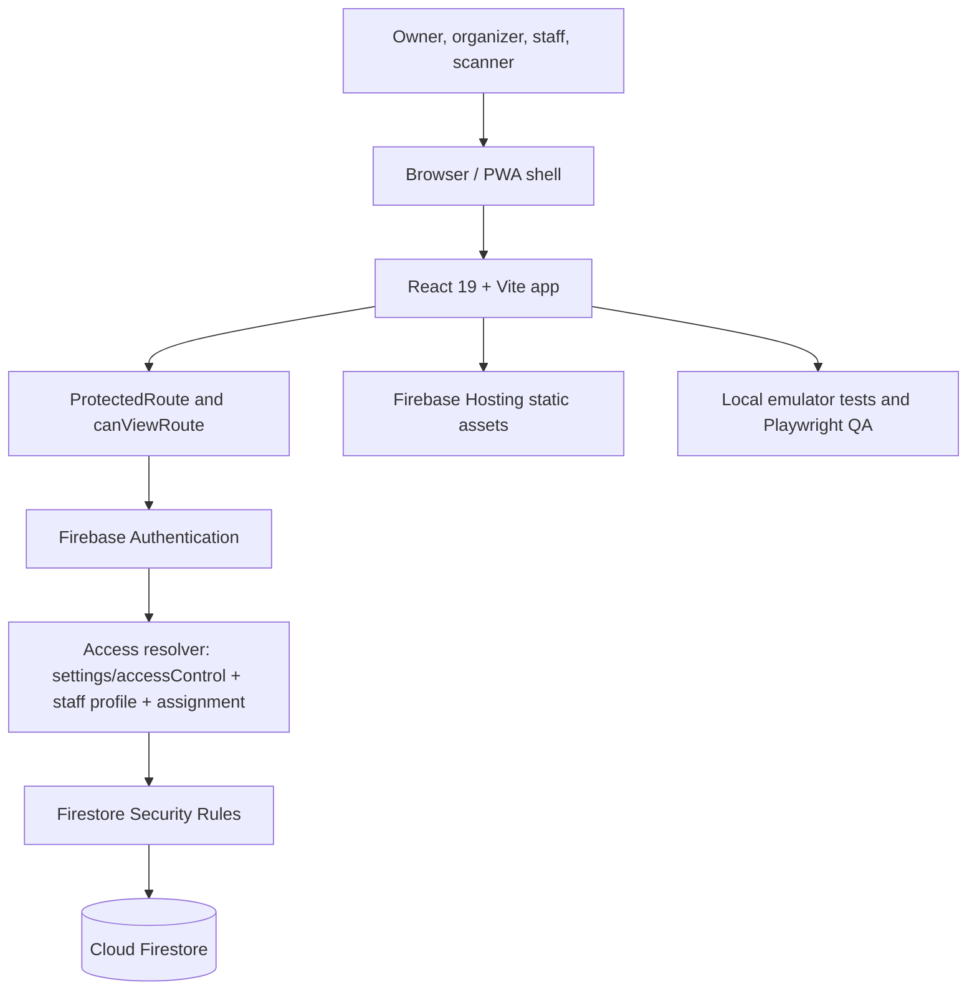
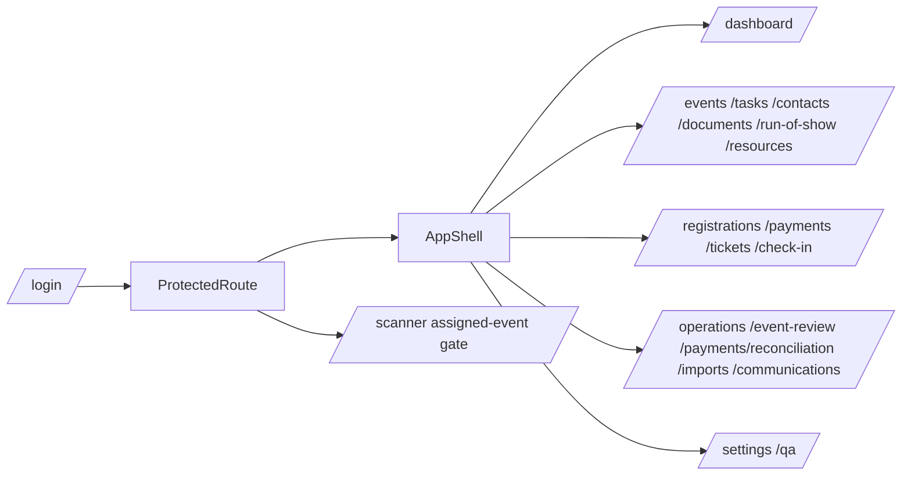
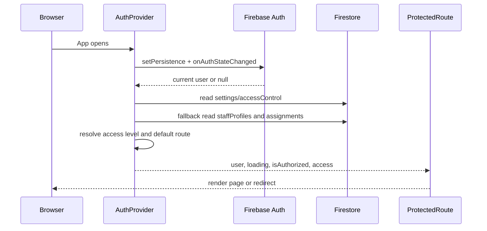
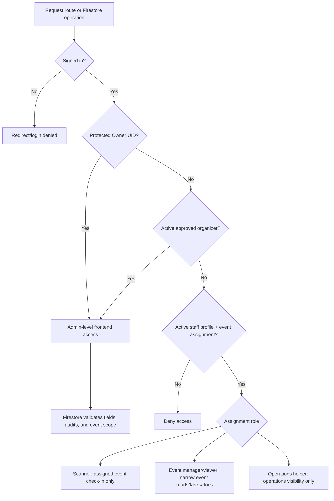
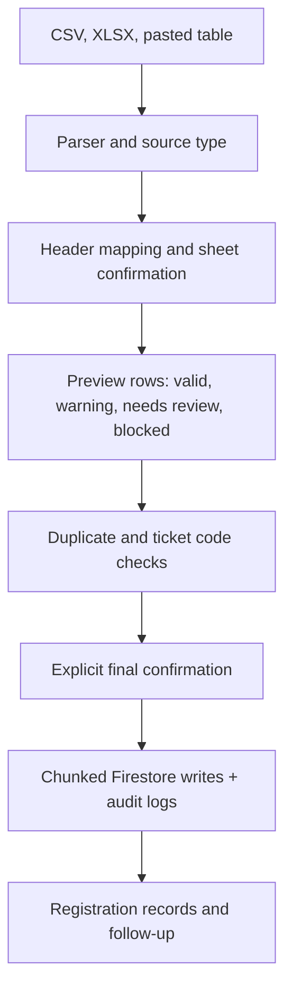
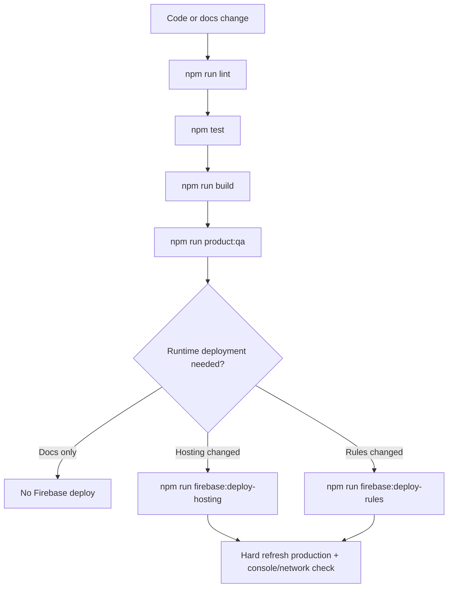

<!-- Source: docs\manual\00-cover-and-document-control.md -->

# Gathetr Owner's Technical Operations, Development, Maintenance and Repair Manual

Displayed title: Gathetr Technical Manual

Document version: 2026-08-21 Phase 3
Generated: 2026-08-21T04:41:38.930Z
Application commit documented: 1baf2796f4c5be143bc1f8f242546ebc2c155e1d
Documentation branch at generation: docs/gathetr-technical-manual
Repository: https://github.com/KuroJay246/gathervibes.git
Firebase project: gathervibeshub
Production URL: https://gathervibeshub.web.app

## Document Control

This manual covers the code and configuration present at the recorded commit only. It does not claim to describe later commits unless regenerated.

Source documents in `docs/` are authoritative. The PDF is a generated readable snapshot.

## Protected Boundaries

- Do not expose `.env.local`, cookies, tokens, service account JSON, or private Firebase keys.
- Do not use CPB for synthetic QA or fake data.
- QR payload format must remain `GSV:TICKET:{ticketCode}` unless explicitly approved and migrated.
- Firestore Rules, Auth, Hosting, Functions, and production data require explicit validation and approval before deployment.
- This Phase 3 documentation generation requires no Firebase deployment and makes no runtime behavior change.


---

<!-- Source: docs\manual\01-quick-start-and-emergency-reference.md -->

# Quick Start and Emergency Reference

## Immediate Symptom Table

| Symptom | First check | Next manual section |
| --- | --- | --- |
| Blank page | Browser Console and Network; check stale chunk or Firebase config | Troubleshooting: blank page or dynamic import failure |
| Permission denied | Signed-in account, `settings/accessControl`, staff assignment, Firestore rule line | Permissions and Security; Permission runbooks |
| Login fails | Firebase Auth provider, authorized domain, popup/redirect state | Firebase Authentication; Login failure runbook |
| Scanner fails | Camera permission, HTTPS, QR payload, assigned event, ticket code lookup | Imports/Exports/QR; Scanner runbook |
| Build fails | Terminal error and changed files | Build Deployment and Recovery |
| Production fails | Hosting deployment, asset cache, Firebase project, Console | Emergency recovery runbooks |

## Safe First Commands

```powershell
git status --short --branch
git rev-list --left-right --count main...origin/main
npm run lint
npm test
npm run build
```

Do not run deployment commands while diagnosing unless the fix is known, tested, and approved.


---

<!-- Source: docs\manual\02-application-overview.md -->

# Application Overview

Gathetr is a private React/Firebase event operations application for planning, guest management, registration payments, tickets, check-in, operations, run of show, resources, documents, contacts, reports, imports, message preparation, Settings, and System QA.

The active synthetic training event is `CODEX_DEMO - Full System Walkthrough`. CPB is real historical production data and must not receive synthetic writes.

## Main User Groups

- Protected Owner: UID-protected permanent owner access.
- Approved Organizer: active approved email in `settings/accessControl`.
- Staff roles: active `staffProfiles/{uid}` plus active event assignment.
- Scanner: assigned-event check-in-only route and narrow Firestore update path.

## Stack

| Layer | Actual technology |
| --- | --- |
| Frontend | React ^19.2.0, Vite ^7.2.4, React Router ^8.3.0 |
| Styling | Tailwind CSS ^4.1.17 through @tailwindcss/vite |
| Backend services | Firebase client SDK ^12.6.0 |
| Database | Cloud Firestore with local emulator tests |
| Authentication | Firebase Authentication with Google and email/password |
| Hosting | Firebase Hosting classic static SPA rewrites to index.html |
| QR | qrcode ^1.5.4; scanner uses html5-qrcode ^2.3.8 |
| Excel parsing | read-excel-file ^9.2.0; xlsx package intentionally absent |


---

<!-- Source: docs\manual\03-system-architecture.md -->

# System Architecture

## High-Level Flow



## Important Boundaries

- Frontend route checks improve user experience but do not replace Firestore Rules.
- Firestore Rules are the backend security boundary.
- Audit logs are append-only evidence and are coupled to business mutations.
- Message Builder is copy-only; it does not send email.
- Documents are references/links and metadata only; no Firebase Storage upload is active.


---

<!-- Source: docs\manual\04-project-file-map.md -->

# Project File Map

## Feature Ownership Map

| Feature | Main files | Related tests | Risk |
| --- | --- | --- | --- |
| Authentication and access resolution | src/lib/firebase.js; src/auth/AuthProvider.jsx; src/auth/ProtectedRoute.jsx; src/utils/accessRoles.js; src/config/protectedOwner.js | tests/auth-reliability.test.js; tests/protected-owner-authorization-matrix.test.js; tests/settings-access-management.test.js | High |
| Events and working event | src/pages/EventsPage.jsx; src/services/eventService.js; src/events/ActiveEventProvider.jsx; src/utils/eventPlanning.js | tests/event-utils.test.js; tests/phase26-event-categories-capabilities.test.js | High |
| Tasks and deadlines | src/pages/TasksPage.jsx; src/services/taskService.js; src/utils/taskWorkflow.js | tests/phase2-guided-event-setup-task-deadline.test.js; tests/task-workflow-rules.test.js | Medium |
| Guests and registrations | src/pages/RegistrationsPage.jsx; src/services/registrationService.js; src/utils/validators.js; src/utils/registrationMetrics.js | tests/registration-utils.test.js; tests/registration-metrics.test.js | High |
| Registration payments | src/pages/PaymentsPage.jsx; src/utils/financeUtils.js; src/utils/paymentStatus.js | tests/phase23b-payments-operations-boundaries.test.js; tests/payments-operations-refinement-2026-08.test.js | High |
| Review and reconciliation | src/pages/PaymentReconciliationPage.jsx; src/services/reconciliationReadService.js; src/utils/paymentReconciliation.js; src/utils/reconciliationWorkbook.js | tests/phase23c-payment-reconciliation.test.js | High |
| Tickets and QR | src/pages/TicketsPage.jsx; src/components/tickets/TicketQrCode.jsx; src/services/ticketService.js; src/utils/ticketUtils.js; src/utils/qrTicketUtils.js | tests/phase45-ticketing.test.js; tests/phase7-qr-checkin.test.js | High |
| Check-in and scanner | src/pages/CheckInPage.jsx; src/pages/ScannerPage.jsx; src/components/checkin/QrScannerPanel.jsx; src/utils/checkInUtils.js | tests/phase14-camera-checkin.test.js; tests/firestore-checkin-rules.test.js; e2e/workflows.spec.js | High |
| Imports and XLSX parsing | src/pages/ImportsPage.jsx; src/services/importService.js; src/utils/importUtils.js; src/utils/xlsxImport.js | tests/import-center.test.js; tests/import-center-workflow-upgrade.test.js | High |
| Operations ledger and commitments | src/pages/OperationsPage.jsx; src/services/operationsLedgerService.js; src/components/operations/PartnerCommitmentsPanel.jsx | tests/phase19-operations-productivity.test.js; tests/phase23b-payments-operations-boundaries.test.js | High |
| Run of Show | src/pages/RunOfShowPage.jsx; src/services/runOfShowService.js; src/utils/runOfShow.js | tests/run-of-show-resources-foundation.test.js; tests/run-of-show-resource-rules.test.js | Medium |
| Equipment and supplies | src/pages/ResourcesPage.jsx; src/services/eventResourceService.js; src/utils/eventResources.js | tests/run-of-show-resources-foundation.test.js; tests/run-of-show-resource-rules.test.js | Medium |
| Documents | src/pages/DocumentsPage.jsx; src/services/documentService.js; src/utils/documentRegistry.js | tests/document-contact-foundation.test.js; tests/document-contact-rules.test.js | Medium |
| Contacts and organizations | src/pages/ContactsPage.jsx; src/services/contactService.js; src/utils/contactDirectory.js | tests/document-contact-foundation.test.js; tests/document-contact-rules.test.js | Medium |
| Settings, staff, integrations | src/pages/SettingsPage.jsx; src/services/accessManagementService.js; src/services/staffManagementService.js; src/services/integrationSettingsService.js | tests/settings-access-management.test.js | High |
| Message Builder | src/pages/CommunicationsPage.jsx; src/utils/communicationsUtils.js | tests/phase6-communications.test.js | Medium |
| System QA | src/pages/QaPage.jsx; src/utils/qaHelper.js; src/utils/runtimeHealth.js | tests/production-qa.test.js; tests/settings-systemqa-tutorial-final-refinement.test.js | Medium |
| Tutorial/onboarding | src/tutorial/* | tests/onboarding-flow.test.js; tests/phase26-interactive-product-tour.test.js; e2e/tutorial.spec.js | Medium |

## Root Configuration

| Path | Purpose | Risk |
| --- | --- | --- |
| package.json | Scripts and dependencies for development, QA, E2E, Firebase deploy helpers, docs generation. | High |
| firebase.json | Auth provider notes, emulator ports, Firestore file references, Hosting headers and rewrites. | High |
| firestore.rules | Backend authorization and schema validation. | Critical |
| firestore.indexes.json | Firestore composite index configuration. | High |
| vite.config.js | Vite/React/Tailwind build configuration. | Medium |
| playwright.config.js | E2E browser test configuration and emulator env. | Medium |
| AI_AGENT_RULES.md | Permanent coding assistant governance. | High |


---

<!-- Source: docs\manual\05-frontend-react-and-tailwind.md -->

# Frontend React and Tailwind

Entry point: `src/main.jsx`
Top-level app: `src/App.jsx`
Authenticated shell: `src/layout/AppShell.jsx`
Global styles: `src/styles.css`

## React Patterns

- Lazy-loaded route pages are declared in `src/App.jsx`.
- `ProtectedRoute` blocks unauthenticated or unauthorized users.
- `AppShell` owns desktop sidebar, mobile drawer, mobile tab bar, page titles, Admin Search, page guidance, and TutorialProvider wrapping.
- Firebase writes are kept in service modules under `src/services/`.
- Shared validation and display helpers live in `src/utils/`.

## Tailwind Usage

Tailwind is used directly through class names and the Vite Tailwind plugin. The app uses compact cards, dense grids, responsive `sm`, `md`, `lg`, `xl` breakpoints, and semantic color usage tied to the Gather & Savor visual system.

Troubleshooting:

- Element not visible: check responsive utility prefixes and route/access gating.
- Mobile overflow: inspect fixed widths, tables, and long event names.
- Dynamic class not applying: avoid constructing class strings that Tailwind cannot see statically.
- Form accessibility issue: inspect associated label, id, name, and focus behavior.


---

<!-- Source: docs\manual\06-routing-and-navigation.md -->

# Routing and Navigation

Routes are declared in `src/App.jsx`; page titles and navigation groups are in `src/layout/AppShell.jsx`.

## Route Map

| Route | Title | Purpose | Component/Gate | Access | Source |
| --- | --- | --- | --- | --- | --- |
| /dashboard | Event Overview | Current event status, priorities, and next actions | <DashboardPage /> | Authenticated route gate | src/App.jsx; src/layout/AppShell.jsx |
| /events | Events | Plan and organize every gathering | <EventsPage /> | Authenticated route gate | src/App.jsx; src/layout/AppShell.jsx |
| /tasks | Tasks & Deadlines | Event-scoped work, blockers, and follow-up dates | <TasksPage /> | Authenticated route gate | src/App.jsx; src/layout/AppShell.jsx |
| /registrations | Guests & Registrations | Manage registration records and guest counts | <RegistrationsPage /> | Authenticated route gate | src/App.jsx; src/layout/AppShell.jsx |
| /payments | Registration Payments | Review registration charges, payments, balances, and follow-up | <AssignedEventGate purpose="Payments"><PaymentsPage /></AssignedEventGate> | Authenticated + assigned Working Event gate | src/App.jsx; src/layout/AppShell.jsx |
| /payments/reconciliation | Review & Reconcile Records | Read-only workbook comparison before any correction | <PaymentReconciliationPage /> | Authenticated route gate | src/App.jsx; src/layout/AppShell.jsx |
| /tickets | Tickets | Assign ticket codes and prepare QR access | <TicketsPage /> | Authenticated route gate | src/App.jsx; src/layout/AppShell.jsx |
| /check-in | Check-In | Track event-day attendance | <AssignedEventGate purpose="Check-In"><CheckInPage /></AssignedEventGate> | Authenticated + assigned Working Event gate | src/App.jsx; src/layout/AppShell.jsx |
| /operations | Operations | Track event-level money and obligations | <AssignedEventGate purpose="Operations"><OperationsPage /></AssignedEventGate> | Authenticated + assigned Working Event gate | src/App.jsx; src/layout/AppShell.jsx |
| /run-of-show | Run of Show | Event-day sequence, supplier arrivals, dependencies, and Now/Next | <AssignedEventGate purpose="Run of Show"><RunOfShowPage /></AssignedEventGate> | Authenticated + assigned Working Event gate | src/App.jsx; src/layout/AppShell.jsx |
| /resources | Equipment & Supplies | Equipment, supplies, packing, pickup, and return tracking | <AssignedEventGate purpose="Resources"><ResourcesPage /></AssignedEventGate> | Authenticated + assigned Working Event gate | src/App.jsx; src/layout/AppShell.jsx |
| /documents | Documents | Event document references, links, and evidence | <DocumentsPage /> | Authenticated route gate | src/App.jsx; src/layout/AppShell.jsx |
| /contacts | Contacts & Organizations | Reusable people, businesses, and event relationships | <ContactsPage /> | Authenticated route gate | src/App.jsx; src/layout/AppShell.jsx |
| /event-review | Reports | Read-only follow-up, payments, operations, and summary | <EventReviewPage /> | Authenticated route gate | src/App.jsx; src/layout/AppShell.jsx |
| /imports | Import Center | Bring in CSV exports and pasted table rows safely | <ImportsPage /> | Authenticated route gate | src/App.jsx; src/layout/AppShell.jsx |
| /qa | System QA | System health, data checks, and safe test guidance | <QaPage /> | Authenticated route gate | src/App.jsx; src/layout/AppShell.jsx |
| /communications | Message Builder | Create, personalize, and copy event messages | <CommunicationsPage /> | Authenticated route gate | src/App.jsx; src/layout/AppShell.jsx |
| /settings | Settings | Practical workspace and event defaults | <SettingsPage /> | Authenticated route gate | src/App.jsx; src/layout/AppShell.jsx |



Public route: `/login`.

Redirect aliases: `/security -> /settings`, `/reconciliation -> /payments/reconciliation`, `/reports -> /event-review`.


---

<!-- Source: docs\manual\07-firebase-authentication.md -->

# Firebase Authentication

Firebase initialization is in `src/lib/firebase.js`. Authentication lifecycle is in `src/auth/AuthProvider.jsx`.

## Auth Sequence



Definitions:

- Authentication state: Firebase's current determination of whether a user is signed in.
- Authorization state: Gathetr's determination that the signed-in user has owner, approved organizer, or assigned staff access.

## Flow

1. App initializes Firebase from Vite environment variables.
2. Auth persistence is set to browser local persistence.
3. Firebase reports the current user through `onAuthStateChanged`.
4. Gathetr reads `settings/accessControl` for approved organizer access.
5. If organizer access is not found, it reads `staffProfiles/{uid}` and active assignment docs for supported event IDs.
6. `getUserAccessLevel` builds the access object used by route gates and labels.
7. Firestore Rules still enforce every backend read/write.


---

<!-- Source: docs\manual\08-firestore-data-model.md -->

# Firestore Data Model

This dictionary is based on current services, Firestore Rules, and tests. It does not include real production personal data.

## Collections and Subcollections

| Collection path | Purpose | Code that uses it | Rules reference | Security note |
| --- | --- | --- | --- | --- |
| settings/accessControl | Authoritative approved organizer source plus metadata records. | src/auth/AuthProvider.jsx; src/services/accessManagementService.js; src/pages/SettingsPage.jsx | firestore.rules match /settings/accessControl | Protected Owner only for mutations; approved admins read. |
| settings/accessControl/history/{historyId} | Append-only history for organizer access changes. | src/services/accessManagementService.js | firestore.rules match /settings/accessControl/history/{historyId} | Protected Owner create; approved admins read. |
| settings/integrations | Supported integration status settings surfaced in Settings. | src/services/integrationSettingsService.js | firestore.rules match /settings/integrations | Protected Owner create/update; approved admins read. |
| events/{eventId} | Event records, planning data, capability configuration, and working-event source. | src/services/eventService.js; src/events/ActiveEventProvider.jsx | firestore.rules match /events/{eventId} | Approved admins manage; assigned staff can read assigned events. |
| events/{eventId}/staffAssignments/{uid} | Event-scoped staff assignment records. | src/services/staffManagementService.js; src/auth/AuthProvider.jsx | firestore.rules match /events/{eventId}/staffAssignments/{uid} | Approved admins manage; assigned user can read own active assignment. |
| events/{eventId}/tasks/{taskId} | Event-scoped tasks and deadlines. | src/services/taskService.js | firestore.rules match /events/{eventId}/tasks/{taskId} | Approved admins and assigned event managers manage; viewers can read. |
| registrations/{registrationId} | Guest registration, ticket, payment, and check-in status records. | src/services/registrationService.js; src/services/ticketService.js | firestore.rules match /registrations/{registrationId} | Approved admins manage; assigned scanners can perform narrow check-in updates. |
| auditLogs/{logId} | Append-only audit evidence for business mutations. | src/services/auditService.js; service write batches | firestore.rules match /auditLogs/{logId} | Create only when matching a permitted target mutation; never update/delete. |
| operationsLedger/{ledgerEntryId} | Event-level Operations ledger, commitments, partners, in-kind support. | src/services/operationsLedgerService.js | firestore.rules match /operationsLedger/{ledgerEntryId} | Approved admins create/update; no delete. |
| events/{eventId}/documents/{documentId} | Event document references and external links. No Firebase Storage upload. | src/services/documentService.js | firestore.rules match /events/{eventId}/documents/{documentId} | Approved admins and event managers create/update; admins delete. |
| events/{eventId}/runOfShow/{itemId} | Event-day schedule sequence, dependencies, arrivals, status. | src/services/runOfShowService.js | firestore.rules match /events/{eventId}/runOfShow/{itemId} | Approved admins manage; assigned event staff can read through task read gate. |
| events/{eventId}/resources/{resourceId} | Equipment, supplies, packing, pickup, return, quantity tracking. | src/services/eventResourceService.js | firestore.rules match /events/{eventId}/resources/{resourceId} | Approved admins manage; assigned event staff can read through task read gate. |
| contacts/{contactId} | Reusable contact directory. | src/services/contactService.js | firestore.rules match /contacts/{contactId} | Approved admins create/update/read; delete false. |
| organizations/{organizationId} | Reusable organization directory. | src/services/contactService.js | firestore.rules match /organizations/{organizationId} | Approved admins create/update/read; delete false. |
| events/{eventId}/contactLinks/{linkId} | Event relationship links to contacts/organizations. | src/services/contactService.js | firestore.rules match /events/{eventId}/contactLinks/{linkId} | Approved admins and event managers create/update; admins delete. |
| accessRequests/{requestId} | Signed-in user access request workflow. | src/services/accessRequestContract.js | firestore.rules match /accessRequests/{requestId} | Signed-in create; approved admins review; no delete. |
| staffProfiles/{uid} | Global staff profile records. | src/services/staffManagementService.js; src/auth/AuthProvider.jsx | firestore.rules match /staffProfiles/{uid} | Approved admins manage; staff can read own active profile. |

## Indexes

| Collection group | Fields | Purpose |
| --- | --- | --- |
| registrations | eventId ASCENDING, createdAt DESCENDING | Supports scoped Firestore query ordering used by the app. |

## Schema Truth Rule

Do not infer schema from one example record. Cross-check service writes, page reads, utils, Firestore Rules validators, and tests.


---

<!-- Source: docs\manual\09-permissions-and-security-rules.md -->

# Permissions and Security Rules

Permission architecture has two layers:

1. Frontend access checks in `src/utils/accessRoles.js` and `ProtectedRoute`.
2. Firestore Rules in `firestore.rules`.



## Permission Matrix

| Action | Protected Owner | Approved Organizer/Admin | Assigned Staff | Scanner | Unapproved |
| --- | --- | --- | --- | --- | --- |
| Open organizer shell | Yes | Yes | Limited by assigned route | No, scanner uses /scanner | No |
| Manage Settings organizer access | Yes, immutable owner cannot be removed | No owner-only controls | No | No | No |
| Create/update events | Yes | Yes | No | No | No |
| Read assigned event | Yes | Yes | Yes if assignment active | Yes for scanner route | No |
| Create/update registrations | Yes | Yes | No | No except scanner check-in fields | No |
| Assign tickets | Yes | Yes | No | No | No |
| Complete check-in | Yes | Yes | No unless scanner assignment | Yes for assigned event | No |
| Use Operations ledger | Yes | Yes | operations-helper read only | No | No |
| Use Import Center | Yes | Yes | No | No | No |
| Read documents/tasks as assigned staff | Yes | Yes | event-manager/viewer where allowed | No | No |
| Create audit logs | Only with matching mutation | Only with matching mutation | Only where rules allow matching mutation | Only check-in audit path | No |

## Firestore Rules Reference

Important helper functions include `isSignedIn`, `isProtectedOwner`, `isApprovedAdmin`, `activeStaffProfile`, `activeStaffAssignment`, `isAssignedScanner`, `canReadTask`, and `canManageTask`.

Rules distinguish `resource.data` from `request.resource.data`, and create/read/update/delete paths are intentionally different. Query rules are not filters: if a query can return forbidden documents, Firestore denies the whole query.


---

<!-- Source: docs\manual\10-events-guests-tickets-and-checkin.md -->

# Events, Guests, Tickets, and Check-In

## Event Management

Events are managed by `EventsPage` and `eventService`. The Working Event context determines which event-scoped pages load data.

## Guest Registrations

Registrations include guest identity, persons attending, payment state, ticket status, historical attendance evidence, and scanner-confirmed check-in fields. Registration mutations must stay atomic with audit evidence.

## Tickets and QR

QR payload is exactly:

```text
GSV:TICKET:{ticketCode}
```

Do not put private guest data into QR payloads.

## Check-In Flow

```mermaid
flowchart TD
  Ticket[Ticket code] --> Payload[GSV:TICKET:{ticketCode}]
  Payload --> QR[QRCode rendering]
  QR --> Scanner[Camera or manual scanner panel]
  Scanner --> Parse[qrTicketUtils parses safe ticket code]
  Parse --> Lookup[Lookup registration in selected/assigned event]
  Lookup --> Confirm[Operator explicitly checks in]
  Confirm --> Firestore[Minimal checkedIn fields + audit log]
  Firestore --> Feedback[Success, duplicate, or permission feedback]
```


---

<!-- Source: docs\manual\11-imports-exports-and-qr-systems.md -->

# Imports, Exports, and QR Systems

## Import Flow



Supported sources: CSV, XLSX through `read-excel-file`, and pasted table rows. The app uses preview-first validation, explicit sheet confirmation, duplicate detection, ticket-code collision checks, and chunked writes with audits.

Exports are client-side generated files from `src/utils/exportUtils.js` and related finance/reconciliation helpers. Audit log and access-control collections are not included in ordinary organizer exports.


---

<!-- Source: docs\manual\12-testing-and-quality-assurance.md -->

# Testing and Quality Assurance

## Command Reference

| Command | Purpose | Actual script | When to run | Expected result |
| --- | --- | --- | --- | --- |
| npm run dev | Local validation/development command | vite | During development, QA, or documentation validation | Exit code 0; command-specific pass message |
| npm run build | Local validation/development command | vite build | During development, QA, or documentation validation | Exit code 0; command-specific pass message |
| npm run preview | Local validation/development command | vite preview | During development, QA, or documentation validation | Exit code 0; command-specific pass message |
| npm run docs:generate | Local validation/development command | node scripts/docs/generateTechnicalManual.mjs | During development, QA, or documentation validation | Exit code 0; command-specific pass message |
| npm run docs:validate | Local validation/development command | node scripts/docs/validateTechnicalDocs.mjs | During development, QA, or documentation validation | Exit code 0; command-specific pass message |
| npm run lint | Local validation/development command | eslint src tests scripts e2e eslint.config.js vite.config.js playwright.config.js | During development, QA, or documentation validation | Exit code 0; command-specific pass message |
| npm run test | Local validation/development command | node --test tests/*.test.js | During development, QA, or documentation validation | Exit code 0; command-specific pass message |
| npm run doctor | Local validation/development command | react-doctor . --project . --scope full --blocking none --no-telemetry | During development, QA, or documentation validation | Exit code 0; command-specific pass message |
| npm run doctor:changed | Local validation/development command | react-doctor . --project . --scope changed --base main --blocking error --no-telemetry | During development, QA, or documentation validation | Exit code 0; command-specific pass message |
| npm run doctor:json | Local validation/development command | react-doctor . --project . --scope full --blocking none --json --json-compact --no-telemetry | During development, QA, or documentation validation | Exit code 0; command-specific pass message |
| npm run product:copy-scan | Local validation/development command | node scripts/product/copyScan.mjs | During development, QA, or documentation validation | Exit code 0; command-specific pass message |
| npm run product:routes | Local validation/development command | node scripts/product/routeInventory.mjs | During development, QA, or documentation validation | Exit code 0; command-specific pass message |
| npm run product:bundle | Local validation/development command | node scripts/product/bundleSummary.mjs | During development, QA, or documentation validation | Exit code 0; command-specific pass message |
| npm run product:docs | Local validation/development command | node scripts/product/documentationCheck.mjs | During development, QA, or documentation validation | Exit code 0; command-specific pass message |
| npm run product:legacy | Local validation/development command | node scripts/product/legacyControlCheck.mjs | During development, QA, or documentation validation | Exit code 0; command-specific pass message |
| npm run product:qa | Local validation/development command | node scripts/product/runProductCommand.mjs qa | During development, QA, or documentation validation | Exit code 0; command-specific pass message |
| npm run product:audit | Local validation/development command | node scripts/product/runProductCommand.mjs audit | During development, QA, or documentation validation | Exit code 0; command-specific pass message |
| npm run product:qa:emulator-checks | Local validation/development command | node --test tests/firestore-checkin-rules.test.js tests/task-workflow-rules.test.js tests/document-contact-rules.test.js tests/run-of-show-resource-rules.test.js && npm run e2e:smoke:inner | During development, QA, or documentation validation | Exit code 0; command-specific pass message |
| npm run e2e:smoke | Local validation/development command | npx -y firebase-tools@14.19.0 emulators:exec --only auth,firestore --project gathervibeshub "npm run e2e:smoke:inner" | During development, QA, or documentation validation | Exit code 0; command-specific pass message |
| npm run e2e:smoke:inner | Local validation/development command | playwright test --project=chromium e2e/navigation.spec.js | During development, QA, or documentation validation | Exit code 0; command-specific pass message |
| npm run e2e:full | Local validation/development command | npx -y firebase-tools@14.19.0 emulators:exec --only auth,firestore --project gathervibeshub "playwright test --project=chromium" | During development, QA, or documentation validation | Exit code 0; command-specific pass message |
| npm run e2e:firefox | Local validation/development command | npx -y firebase-tools@14.19.0 emulators:exec --only auth,firestore --project gathervibeshub "playwright test --project=firefox" | During development, QA, or documentation validation | Exit code 0; command-specific pass message |
| npm run e2e:webkit | Local validation/development command | npx -y firebase-tools@14.19.0 emulators:exec --only auth,firestore --project gathervibeshub "playwright test --project=webkit" | During development, QA, or documentation validation | Exit code 0; command-specific pass message |
| npm run admin:ensure-access | Local validation/development command | node scripts/admin/ensureAccessControl.mjs | During development, QA, or documentation validation | Exit code 0; command-specific pass message |
| npm run admin:verify-firebase | Local validation/development command | node scripts/admin/verifyFirebaseSetup.mjs | During development, QA, or documentation validation | Exit code 0; command-specific pass message |
| npm run admin:replace-codex-test-with-demo | Local validation/development command | node scripts/admin/replaceCodexTestWithDemoEvent.mjs | During development, QA, or documentation validation | Exit code 0; command-specific pass message |
| npm run admin:verify-production-fixtures | Local validation/development command | node scripts/admin/verifyProductionFixtures.mjs | During development, QA, or documentation validation | Exit code 0; command-specific pass message |
| npm run admin:verify-production-counts | Local validation/development command | node scripts/admin/verifyProductionCounts.mjs | During development, QA, or documentation validation | Exit code 0; command-specific pass message |
| npm run firebase:deploy-rules | PRODUCTION-IMPACTING COMMAND where noted | npx firebase-tools deploy --only firestore:rules,firestore:indexes --project gathervibeshub | Only after explicit approval and validation | Exit code 0; command-specific pass message |
| npm run firebase:deploy-hosting | PRODUCTION-IMPACTING COMMAND where noted | npx firebase-tools deploy --only hosting --project gathervibeshub | Only after explicit approval and validation | Exit code 0; command-specific pass message |
| npm run firebase:deploy-all | PRODUCTION-IMPACTING COMMAND where noted | npx firebase-tools deploy --only firestore:rules,firestore:indexes,hosting --project gathervibeshub | Only after explicit approval and validation | Exit code 0; command-specific pass message |

## Testing Layers

- Unit and source contract tests: `tests/*.test.js`.
- Firestore Rules tests: rules-specific test files run against emulators.
- E2E smoke: `e2e/navigation.spec.js`.
- Accessibility and responsive E2E: `e2e/accessibility.spec.js`, `e2e/responsive.spec.js`.
- Product QA wrapper: `npm run product:qa`.
- React Doctor: `npm run doctor:json` or `npm run doctor:changed`.

## Date-Sensitive Test Policy

Phase 2 found `tests/document-contact-foundation.test.js` used `2026-08-20` as an expiring-soon fixture. On 2026-08-21 that fixture became expired for helpers using the current clock. It was updated to `2026-08-30` to preserve the intended behavior.

Future date-sensitive tests should either inject an explicit clock into every helper under test or choose dates far enough away to avoid silent expiry.


---

<!-- Source: docs\manual\13-build-deployment-and-recovery.md -->

# Build, Deployment, and Recovery

## Local Build

```powershell
npm ci
npm run lint
npm test
npm run build
npm run product:qa
```

## Firebase Project

Default project in `.firebaserc`: `gathervibeshub`.

Hosting public folder: `dist`.

Security headers and SPA rewrite are configured in `firebase.json`.

## Production-Impacting Commands

| Command | Impact | Prerequisites |
| --- | --- | --- |
| npm run firebase:deploy-hosting | PRODUCTION-IMPACTING COMMAND: deploys Hosting assets from dist. | Build passed; production visual check plan ready. |
| npm run firebase:deploy-rules | PRODUCTION-IMPACTING COMMAND: deploys Firestore Rules and indexes. | Rules tests passed; authorization impact reviewed. |
| npm run firebase:deploy-all | PRODUCTION-IMPACTING COMMAND: deploys Hosting, Rules, and indexes. | Use only when all targets intentionally changed. |

## Deployment Flow



No production deployment is performed by documentation generation.


---

<!-- Source: docs\manual\14-troubleshooting-and-repairs.md -->

# Troubleshooting and Repairs

Use the runbooks in `docs/runbooks/` for step-by-step procedures.

Priority problems:

- Blank page or stale deployment chunk.
- Login or auth persistence failure.
- Missing or insufficient permissions.
- Owner account denied.
- Staff assignment missing.
- Scanner cannot check in.
- Firestore permits data that frontend hides or frontend shows data Firestore denies.
- Build, dependency, emulator, or deployment failure.
- QR scanner failure during an event.


---

<!-- Source: docs\manual\15-legacy-systems-and-technical-debt.md -->

# Legacy Systems and Technical Debt

## Current Register

| Item | Classification | Notes |
| --- | --- | --- |
| Archived migration evidence | archive only / future review required | Located at C:\Users\Jaylan\Documents\Archived Projects\gsv-codex-demo-migration-evidence-2026-08-21. Contains CPB/CODEX_DEMO evidence and old repo snapshots. |
| Legacy repository archive | archive only | Located at C:\Users\Jaylan\Documents\Archived Projects\gathervibes-legacy-repository-archive-2026-08-21. |
| 21 node_modules in historical archive snapshots | future review required | Generated dependencies likely reclaimable, but recursive deletion was blocked in Phase 2. |
| Historical branches | future review required | Branches were not deleted in Phase 2. Review merge status before any cleanup. |
| Active copilot worktree | current / unknown future work | Retained at C:\Users\Jaylan\Documents\gathetr.worktrees\copilot-personalized-welcome-tour-implementation. |
| React Doctor warnings | technical debt | doctor:json reports warnings, but doctor:changed found no issues for Phase 2 changed file. |
| Legacy role aliases | legacy but required | accessRoles retains aliases such as checkInStaff for compatibility. |


---

<!-- Source: docs\manual\16-change-management.md -->

# Change Management

No meaningful coding task is complete until documentation impact has been reviewed.

Every handoff must report:

- Documentation reviewed: YES/NO
- Documentation changed: YES/NO
- Documentation files changed
- Reason no documentation update was required

Use templates in `docs/templates/` for change records, incidents, repair runbooks, release checklists, and manual update checklists.


---

<!-- Source: docs\manual\17-reference-and-glossary.md -->

# Reference and Glossary

## Glossary

- Approved Organizer: an active email in `settings/accessControl`.
- Protected Owner: the permanent UID-protected owner account, independent of mutable allowlists.
- Working Event: selected event context used by event-scoped pages.
- CODEX_DEMO: synthetic training event safe for reversible QA.
- CPB: real completed event; not a synthetic QA target.
- Audit log: append-only evidence document required for many business writes.
- Query rules are not filters: Firestore denies a query if it could return unauthorized documents.

## Search Keywords

```text
Firebase missing or insufficient permissions resource.data request.resource.data
Firestore query rules are not filters
React Firebase auth state loading before Firestore query
Vite dynamic import Failed to fetch dynamically imported module
Firebase Hosting stale service worker chunk cache
Playwright Firebase emulator auth firestore port taken 9099 8080
html5-qrcode camera permission HTTPS mobile browser
GSV:TICKET QR payload ticketCode privacy
read-excel-file browser XLSX import mapping
React Doctor no-loading-flag-reset-outside-finally
```


---

<!-- Source: docs\manual\18-future-app-development-reference.md -->

# Future App Development Reference

Lessons from Gathetr that apply to future React/Firebase apps:

- Design the permission model before building pages.
- Keep frontend route gates and backend Rules aligned but separate.
- Use one authoritative source for access control and display it in Settings.
- Avoid synthetic QA against real event data.
- Keep QR payloads privacy-safe and stable.
- Add emulator-backed rule tests before deploying Rules.
- Document every schema, role, status, and workflow change at the time it changes.
- Keep generated PDFs as snapshots, not the source of truth.
