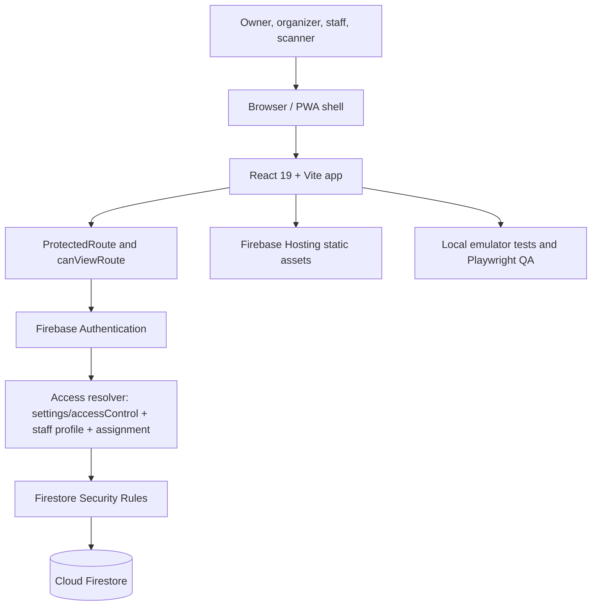

# System Architecture

## High-Level Flow

## Important Boundaries

- Frontend route checks improve user experience but do not replace Firestore Rules.
- Firestore Rules are the backend security boundary.
- Audit logs are append-only evidence and are coupled to business mutations.
- Message Builder is copy-only; it does not send email.
- Documents are references/links and metadata only; no Firebase Storage upload is active.
