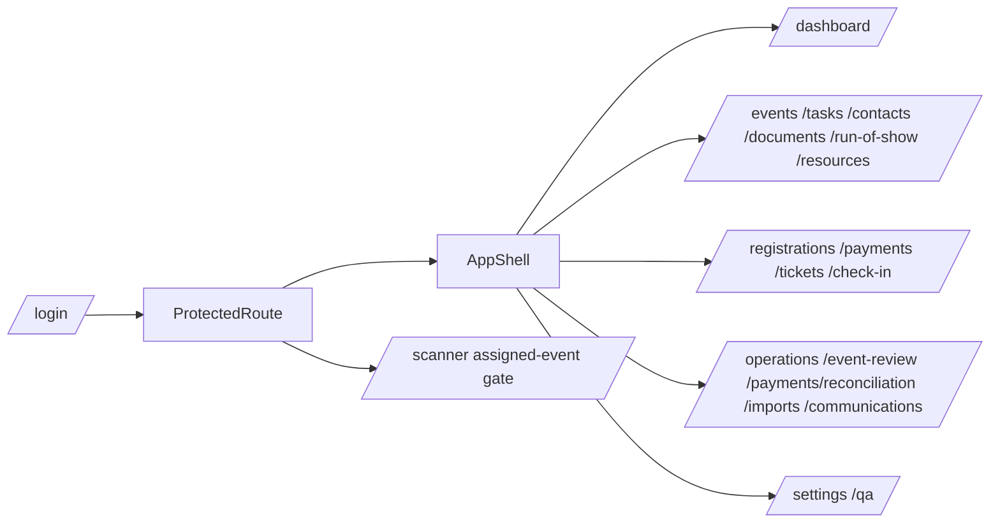

# Routing and Navigation

Routes are declared in `src/App.jsx`; page titles and navigation groups are in `src/layout/AppShell.jsx`.

## Route Map

| Route | Title | Purpose | Component/Gate | Access | Source |
| --- | --- | --- | --- | --- | --- |
| /dashboard | Event Overview | Current event status, priorities, and next actions | <DashboardPage /> | Authenticated route gate | src/App.jsx; src/layout/AppShell.jsx |
| /events | Events | Plan and organize every gathering | <EventsPage /> | Authenticated route gate | src/App.jsx; src/layout/AppShell.jsx |
| /tasks | Tasks & Deadlines | Event-scoped work, blockers, and follow-up dates | <TasksPage /> | Authenticated route gate | src/App.jsx; src/layout/AppShell.jsx |
| /registrations | Guests & Registrations | Manage registration records and guest counts | <RegistrationsPage /> | Authenticated route gate | src/App.jsx; src/layout/AppShell.jsx |
| /payments | Registration Payments | Review registration charges, payments, balances, and follow-up | <AssignedEventGate purpose="Payments"><PaymentsPage /></AssignedEventGate> | Authenticated + assigned Working Event gate | src/App.jsx; src/layout/AppShell.jsx |
| /payments/reconciliation | Review & Reconcile Records | Read-only workbook comparison before any correction | <PaymentReconciliationPage /> | Authenticated route gate | src/App.jsx; src/layout/AppShell.jsx |
| /tickets | Tickets | Assign ticket codes and prepare QR access | <TicketsPage /> | Authenticated route gate | src/App.jsx; src/layout/AppShell.jsx |
| /check-in | Check-In | Track event-day attendance | <AssignedEventGate purpose="Check-In"><CheckInPage /></AssignedEventGate> | Authenticated + assigned Working Event gate | src/App.jsx; src/layout/AppShell.jsx |
| /operations | Operations | Track event-level money and obligations | <AssignedEventGate purpose="Operations"><OperationsPage /></AssignedEventGate> | Authenticated + assigned Working Event gate | src/App.jsx; src/layout/AppShell.jsx |
| /run-of-show | Run of Show | Event-day sequence, supplier arrivals, dependencies, and Now/Next | <AssignedEventGate purpose="Run of Show"><RunOfShowPage /></AssignedEventGate> | Authenticated + assigned Working Event gate | src/App.jsx; src/layout/AppShell.jsx |
| /resources | Equipment & Supplies | Equipment, supplies, packing, pickup, and return tracking | <AssignedEventGate purpose="Resources"><ResourcesPage /></AssignedEventGate> | Authenticated + assigned Working Event gate | src/App.jsx; src/layout/AppShell.jsx |
| /documents | Documents | Event document references, links, and evidence | <DocumentsPage /> | Authenticated route gate | src/App.jsx; src/layout/AppShell.jsx |
| /contacts | Contacts & Organizations | Reusable people, businesses, and event relationships | <ContactsPage /> | Authenticated route gate | src/App.jsx; src/layout/AppShell.jsx |
| /event-review | Reports | Read-only follow-up, payments, operations, and summary | <EventReviewPage /> | Authenticated route gate | src/App.jsx; src/layout/AppShell.jsx |
| /imports | Import Center | Bring in CSV exports and pasted table rows safely | <ImportsPage /> | Authenticated route gate | src/App.jsx; src/layout/AppShell.jsx |
| /qa | System QA | System health, data checks, and safe test guidance | <QaPage /> | Authenticated route gate | src/App.jsx; src/layout/AppShell.jsx |
| /communications | Message Builder | Create, personalize, and copy event messages | <CommunicationsPage /> | Authenticated route gate | src/App.jsx; src/layout/AppShell.jsx |
| /settings | Settings | Practical workspace and event defaults | <SettingsPage /> | Authenticated route gate | src/App.jsx; src/layout/AppShell.jsx |

Public route: `/login`.

Redirect aliases: `/security -> /settings`, `/reconciliation -> /payments/reconciliation`, `/reports -> /event-review`.
