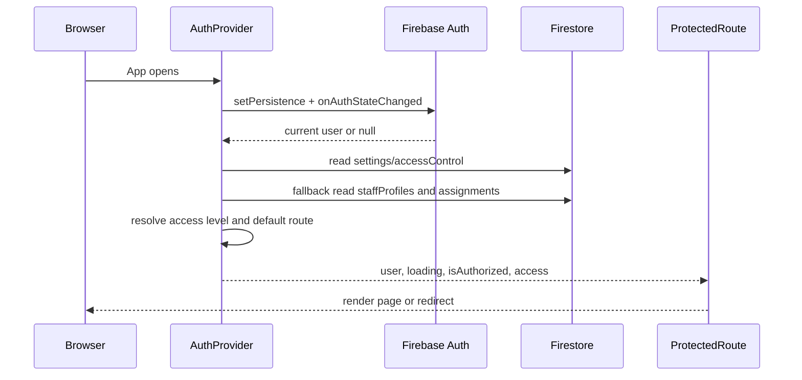

# Firebase Authentication

Firebase initialization is in `src/lib/firebase.js`. Authentication lifecycle is in `src/auth/AuthProvider.jsx`.

## Auth Sequence

Definitions:

- Authentication state: Firebase's current determination of whether a user is signed in.
- Authorization state: Gathetr's determination that the signed-in user has owner, approved organizer, or assigned staff access.

## Flow

1. App initializes Firebase from Vite environment variables.
2. Auth persistence is set to browser local persistence.
3. Firebase reports the current user through `onAuthStateChanged`.
4. Gathetr reads `settings/accessControl` for approved organizer access.
5. If organizer access is not found, it reads `staffProfiles/{uid}` and active assignment docs for supported event IDs.
6. `getUserAccessLevel` builds the access object used by route gates and labels.
7. Firestore Rules still enforce every backend read/write.
