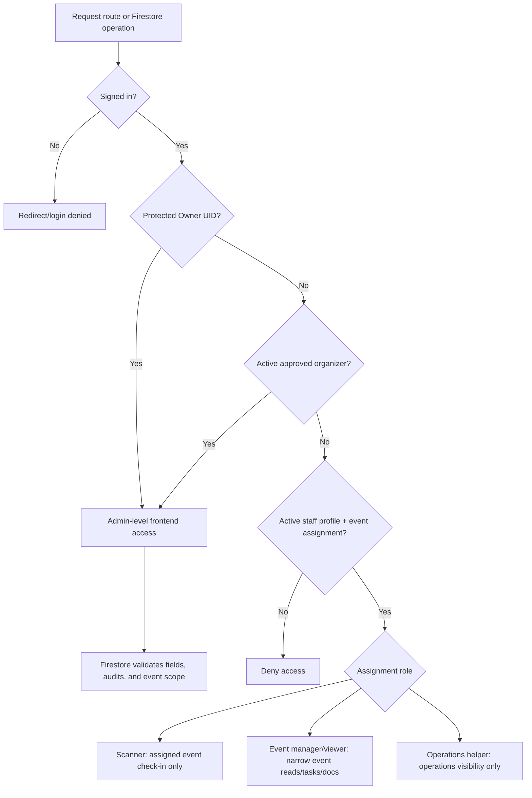

# Permissions and Security Rules

Permission architecture has two layers:

1. Frontend access checks in `src/utils/accessRoles.js` and `ProtectedRoute`.
2. Firestore Rules in `firestore.rules`.

## Permission Matrix

| Action | Protected Owner | Approved Organizer/Admin | Assigned Staff | Scanner | Unapproved |
| --- | --- | --- | --- | --- | --- |
| Open organizer shell | Yes | Yes | Limited by assigned route | No, scanner uses /scanner | No |
| Manage Settings organizer access | Yes, immutable owner cannot be removed | No owner-only controls | No | No | No |
| Create/update events | Yes | Yes | No | No | No |
| Read assigned event | Yes | Yes | Yes if assignment active | Yes for scanner route | No |
| Create/update registrations | Yes | Yes | No | No except scanner check-in fields | No |
| Assign tickets | Yes | Yes | No | No | No |
| Complete check-in | Yes | Yes | No unless scanner assignment | Yes for assigned event | No |
| Use Operations ledger | Yes | Yes | operations-helper read only | No | No |
| Use Import Center | Yes | Yes | No | No | No |
| Read documents/tasks as assigned staff | Yes | Yes | event-manager/viewer where allowed | No | No |
| Create audit logs | Only with matching mutation | Only with matching mutation | Only where rules allow matching mutation | Only check-in audit path | No |

## Firestore Rules Reference

Important helper functions include `isSignedIn`, `isProtectedOwner`, `isApprovedAdmin`, `activeStaffProfile`, `activeStaffAssignment`, `isAssignedScanner`, `canReadTask`, and `canManageTask`.

Rules distinguish `resource.data` from `request.resource.data`, and create/read/update/delete paths are intentionally different. Query rules are not filters: if a query can return forbidden documents, Firestore denies the whole query.
