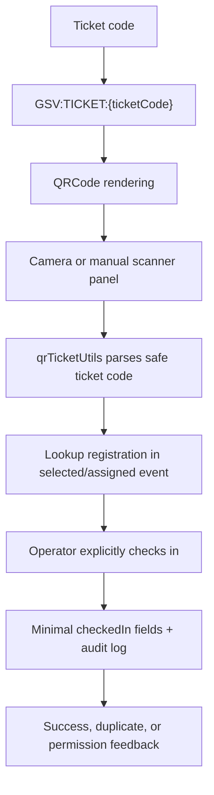

# Events, Guests, Tickets, and Check-In

## Event Management

Events are managed by `EventsPage` and `eventService`. The Working Event context determines which event-scoped pages load data.

## Guest Registrations

Registrations include guest identity, persons attending, payment state, ticket status, historical attendance evidence, and scanner-confirmed check-in fields. Registration mutations must stay atomic with audit evidence.

## Tickets and QR

QR payload is exactly:

```text
GSV:TICKET:{ticketCode}
```

Do not put private guest data into QR payloads.

## Check-In Flow


