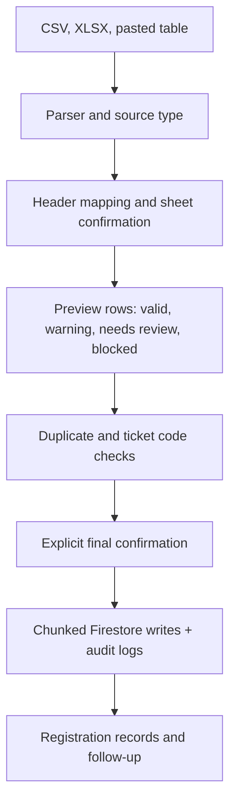

# Imports, Exports, and QR Systems

## Import Flow

Supported sources: CSV, XLSX through `read-excel-file`, and pasted table rows. The app uses preview-first validation, explicit sheet confirmation, duplicate detection, ticket-code collision checks, and chunked writes with audits.

Exports are client-side generated files from `src/utils/exportUtils.js` and related finance/reconciliation helpers. Audit log and access-control collections are not included in ordinary organizer exports.
