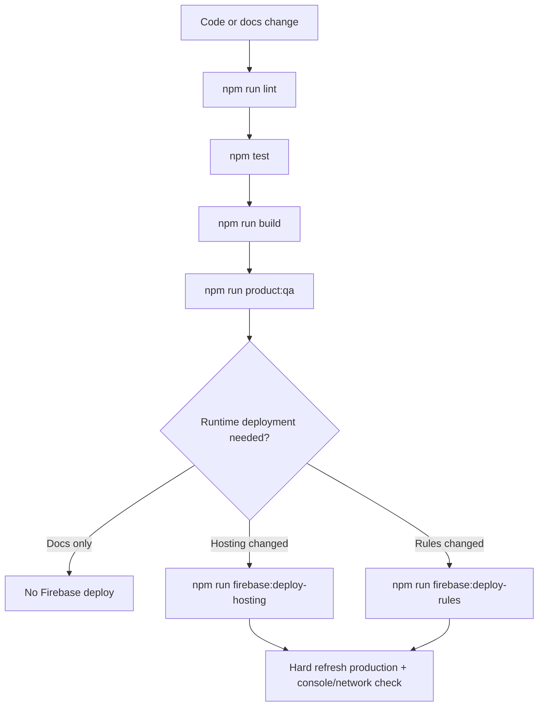

# Build, Deployment, and Recovery

## Local Build

```powershell
npm ci
npm run lint
npm test
npm run build
npm run product:qa
```

## Firebase Project

Default project in `.firebaserc`: `gathervibeshub`.

Hosting public folder: `dist`.

Security headers and SPA rewrite are configured in `firebase.json`.

## Production-Impacting Commands

| Command | Impact | Prerequisites |
| --- | --- | --- |
| npm run firebase:deploy-hosting | PRODUCTION-IMPACTING COMMAND: deploys Hosting assets from dist. | Build passed; production visual check plan ready. |
| npm run firebase:deploy-rules | PRODUCTION-IMPACTING COMMAND: deploys Firestore Rules and indexes. | Rules tests passed; authorization impact reviewed. |
| npm run firebase:deploy-all | PRODUCTION-IMPACTING COMMAND: deploys Hosting, Rules, and indexes. | Use only when all targets intentionally changed. |

## Deployment Flow



No production deployment is performed by documentation generation.
